# Tempico Software

Tempico Software is a suite of tools built to ensure your experience with Tausand's time-to-digital converter.

The software operates via a Graphical User Interface (GUI) which facilitates user interaction with the Tausand Tempico hardware.

## Libraries Used

- **PyTempico**
- **PyQT5**: Using the API provided by pyside2.
- **NumPy**
- **PyQtGraph**
- **PySerial**
- **PyInstaller**
- **HID**

## UML Overview

The UML diagram provides a high-level approximation of the application’s design structure.

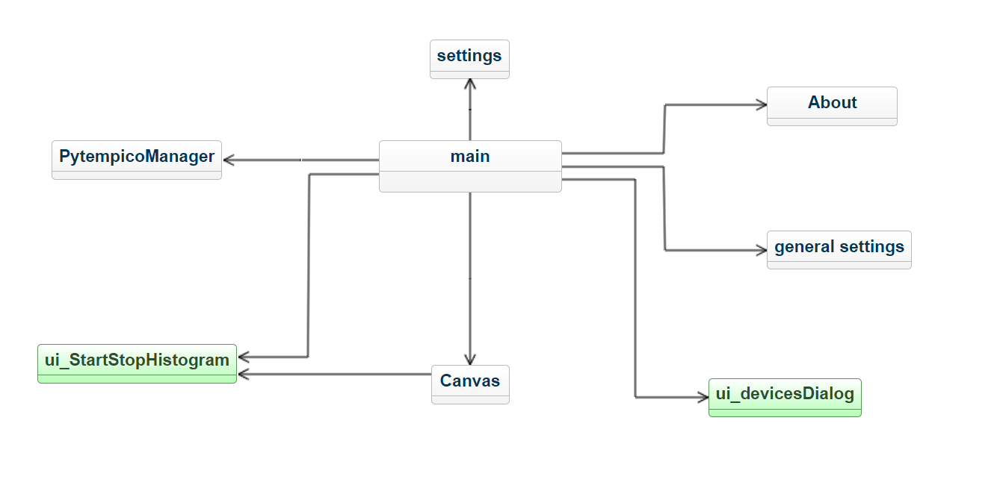

## Functionality

### Open TempicoSoftware

Tempico software always initializes with a dialog that shows the list of Tempico devices connected to the computer. The user can select one of them to open a connection or cancel and initialize the software without a device. Without a device, the software has only two functionalities: see the About window in the navbar next to Settings or connect a device. If the computer doesn't have a Tempico device connected, the dialog doesn't show any device, and you will only be able to cancel or close the window.

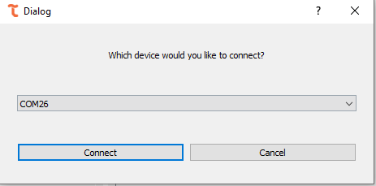

### General settings

The user can configure two parameters of the Tempico device: the first is the threshold voltage and the second is the number of runs. The threshold voltage accepts float numbers between 0.9 V and 1.6 V. The number of runs is a value between 1 and 1000 ( In a single call for measurement, the hardware will execute the specified number of measurements without needing another call for each individual measurement)

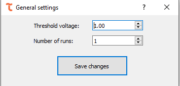

### Channel settings

The user can configure 5 parameters for each stop channel (A, B, C, D). The first is the average cycles, which are the internal measurements performed before obtaining a single averaged output value. Increasing the cycles improves the precision of the data but also increases the time required for each measurement. The accepted values are 1, 2, 4, 8, 16, 32, 64, and 128.

The second parameter is the mode. There are 2 modes, and each mode changes the time ranges of data accepted before the start pulse. In mode 1, the accepted values are between 12 ns and 500 ns, and in mode 2, the values are between 125 ns and 4 ms. The two modes are independent of each other (in other words, if you try to measure in mode 2 a value in the range of mode 1, the data will not be registered).

The third parameter is the number of stops. This parameter determines the number of stops that the channel registers after a single start. However, if the channel expects 5 stops and only gets 4, none of the values will be considered in the data. The accepted stops are 1, 2, 3, 4, and 5.
The fourth parameter is the edge type. In each channel, you can decide if the measured data is the beginning of the stop pulse (RISE) or the end of the stop pulse (FALL).

The fifth parameter is the stop mask. It indicates the range of times in which the measurements will be discarded. For example, if the stop mask is 10 µs, the measurements in the range 0 µs - 10 µs will not be considered. The stop mask accepts values between 0 µs and 4000 µs.

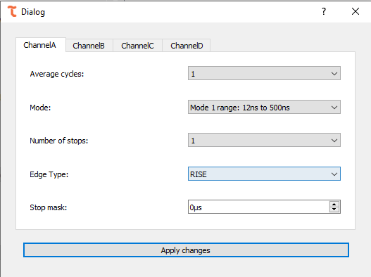

### Main window Start-stop histogram

#### Before measurement

Before performing a measurement, the user can configure the channels and the general settings of the device. Using the checkboxes, the user can select which channels they want to appear in the graphics (at least one channel must be selected). After this, the user can press the "Begin Measurement" button. Note: Once a measurement has begun, user will not be able to change the channel settings, general settings, or select an additional channel. In the middle of a measurement, if the user wants to clear the graphic for a specific channel, it is possible to push the "Clear" button for that specific channel. To finish measurement click on the button End measurement.

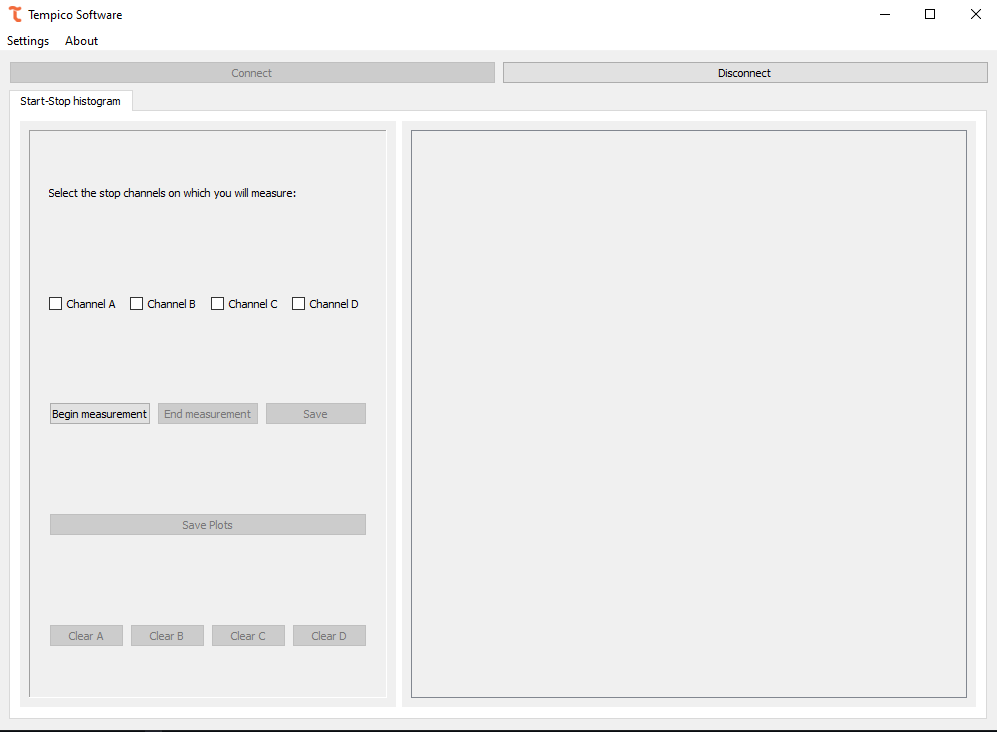

#### After measurement

After finishing a measurement, if the user desires, they can save the measured data for the Tempico device in txt, csv, or dat format using the "Save" button. If the user wants to adjust the view of the graphic, they can scroll with the mouse to see more detail of the histogram. They can then save the image that appears in the software with the "Save Plots" button. The user can select png, jpg, or tiff as the format for the saved image. The route for the files will be inside documents/TempicoSoftwareData. This folder is created automatically if it doesn't exist when the software is started.

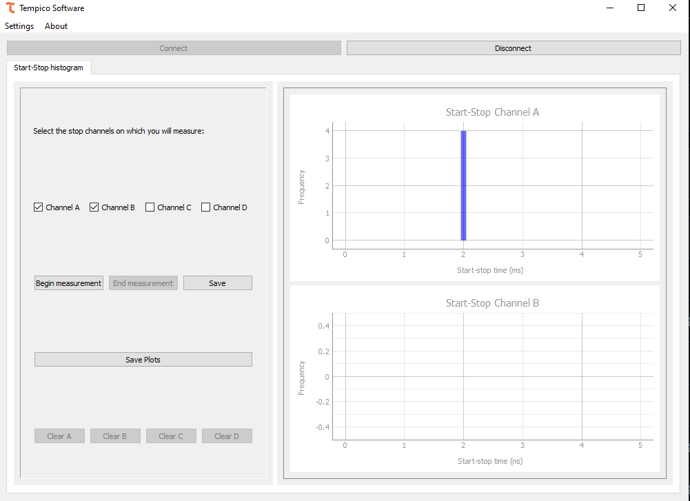

If the user is not in the middle of a measurement, they will be able to disconnect the Tempico device and connect another if they desire. The data will not be lost if the device is disconnected; data is only lost if the user begins a new measurement.

## For Developers

### Creating a virtual environment

Run the following code to create a virtual environment called `.venv`

```
python -m venv .venv
```

#### Activate

- On Unix systems:
  
  ```
  source .venv/bin/activate
  ```

- On Windows:
  
  ```
  .venv\Scripts\activate
  ```

#### Deactivate

```
deactivate
```

### Installing packages

After the virtual environment has been activated, install required packages by using:

```
python -m pip install -r requirements.txt
```

From the console, in the same path of the cloned project, run 

```
python test.py
```

This will allow the program to run correctly (if using a Linux-based OS, use `sudo` at the beginning). If the command does not work, use `python3 test.py`. 

**Note**: It is recommended to use Python version 3.8.10 (32-bit).

To generate the executable, run the following command:

```
pyinstaller --additional-hooks-dir installers/pyinstaller_hooks/ --name TempicoSoftware --onefile --noconsole -i Sources/tausand_small.ico test.py
```

Two folders will be created: build and dist. Inside `dist` you'll find the `.exe` file. To run it correctly, this file must be placed next to the `Sources` folder that contains the images.

### Generate Installer

Once the executable is compiled, we will proceed to create the software installer.

#### Step 1: Download and Install Inno Setup Compiler

First, download the Inno Setup Compiler program and install it on your machine. The download page for the program is available at the following link: [https://jrsoftware.org/isdl.php](https://jrsoftware.org/isdl.php). Download the `.exe` file corresponding to the application installer.

#### Step 2: Open Inno Setup Compiler

Once Inno Setup is installed correctly, open it and follow these steps:

1. First, you will be prompted to either open an existing script or create a new one. Select the option to **Create a New Script Using the Wizard**.

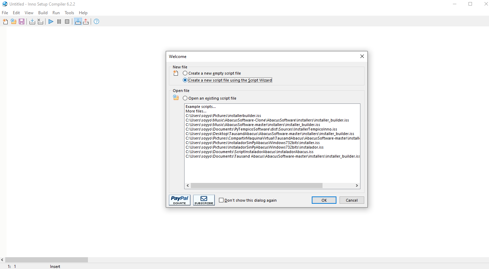

2. In the next window, leave all options unselected and click **Next**.

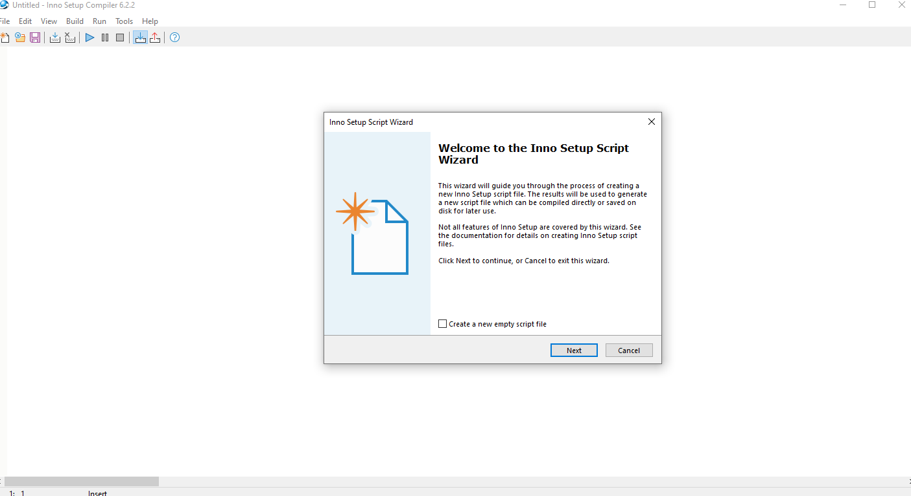

3. You will then be asked to provide the application name, version, publisher, and website (if applicable). For Tempico Software, use the following values for each field.

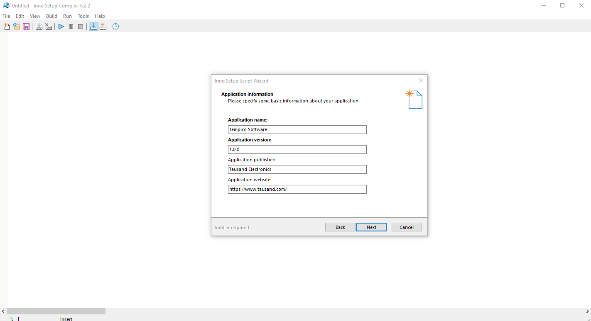

4. Next, specify the default folder for the application and the application name. If these values do not carry over from the previous step, use the specified values provided.

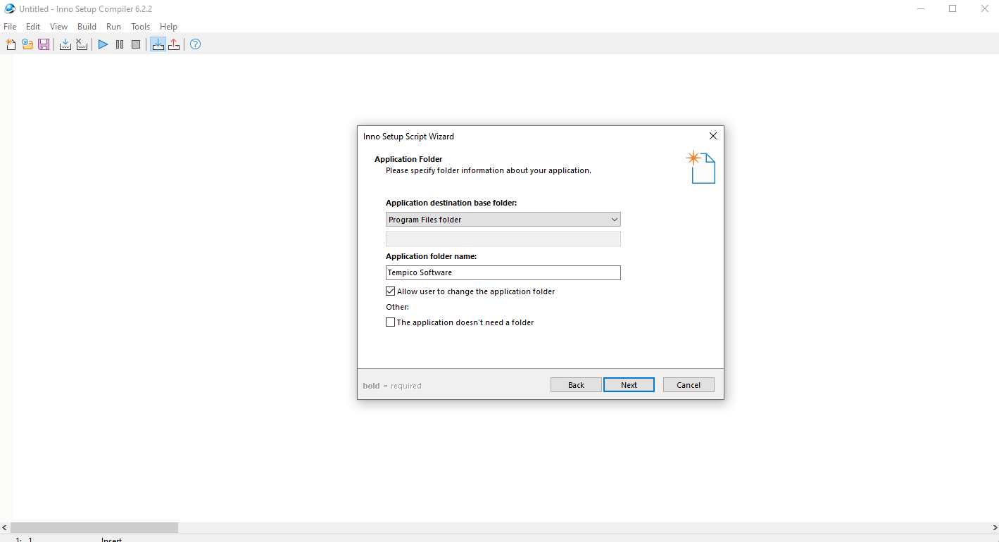

5. In the field **Application Main Executable File**, provide the path to the executable created earlier with PyInstaller. Additionally, click on **Add Folder** to include the images needed by the executable. Locate and select the `Sources` folder containing these image files. Leave all other fields as their default values.

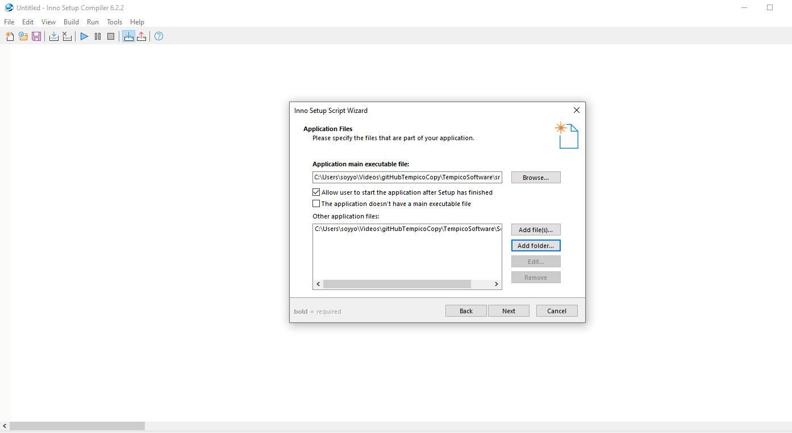

6. For the next four windows, leave the default values as they are (ensure they match the values shown in the provided screenshots).

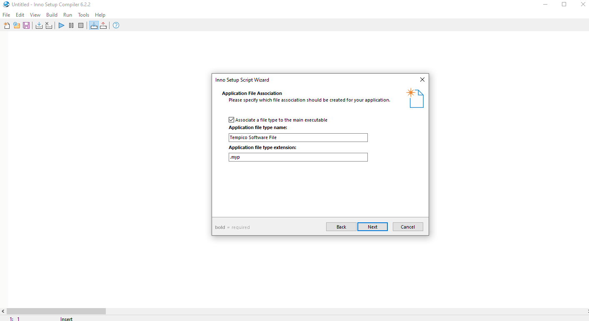

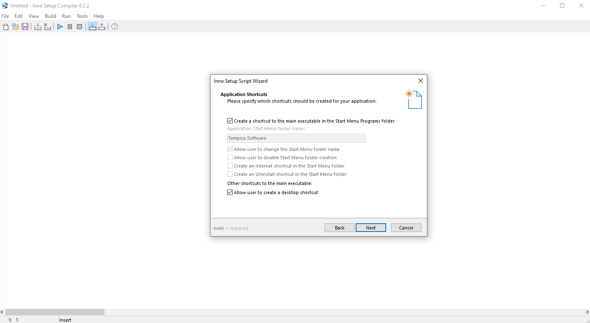

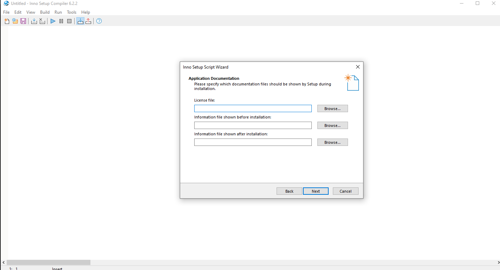


7. You will be prompted to select the installation language. Since Tempico Software only supports English for this version, select **English**.

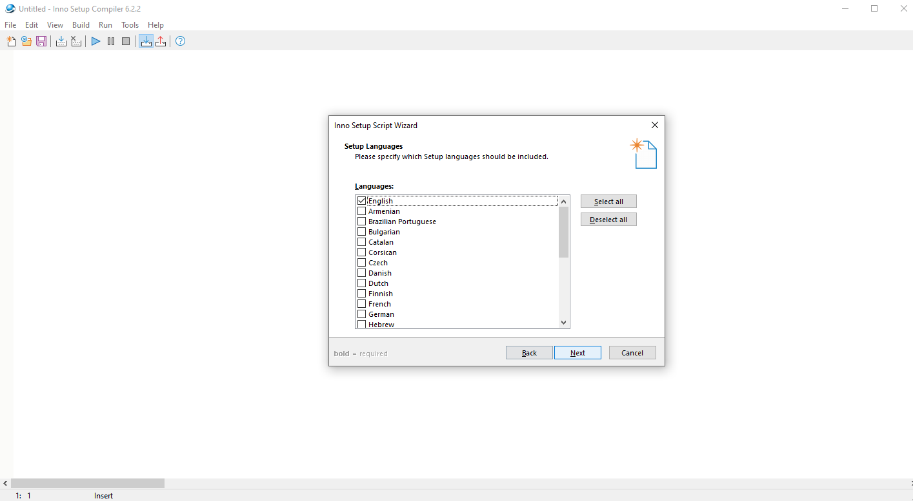

8. In the **Custom Compiler Output Folder** field, specify the directory where the installer will be saved once compiled. This path is flexible and should be chosen based on the developer’s preference. In the **Compiler Output Base File Name** field, enter `Tempico Software Setup`. For **Custom Setup Icon File**, locate the `Sources` folder and select the `tausand_small.ico` icon file. Leave the password field empty.

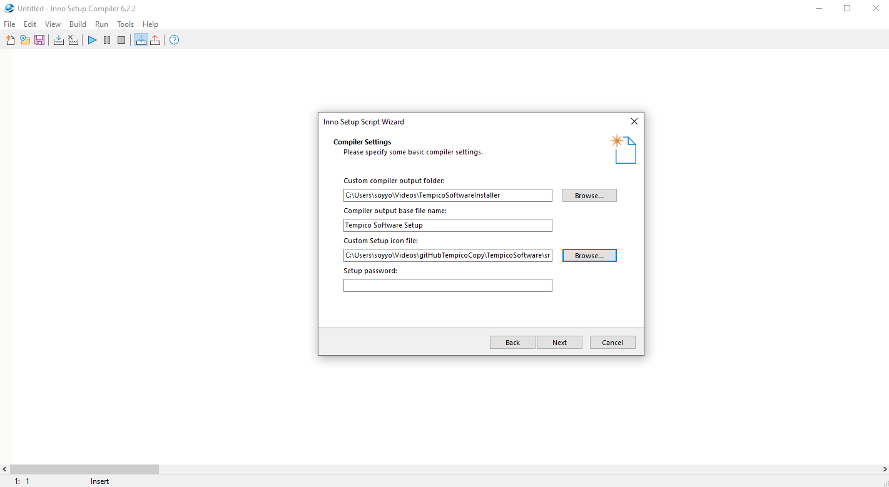

9. For the following windows, simply click **Next** and then **Finish**, keeping the default values unchanged.

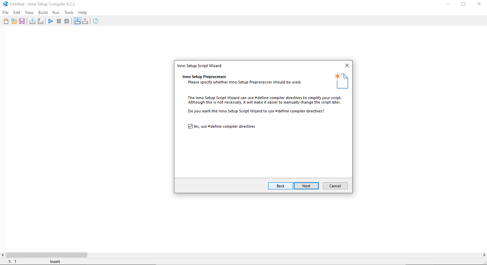

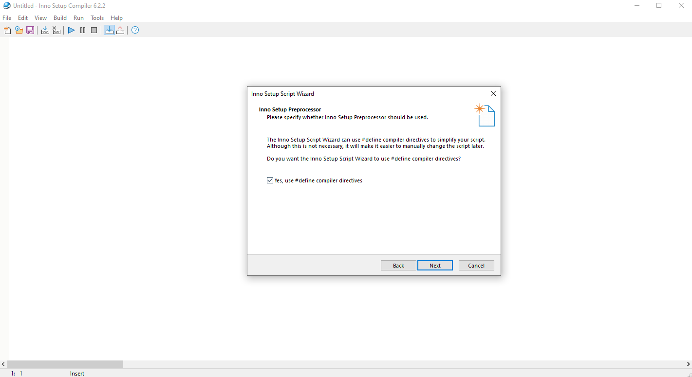
10. Once the setup wizard is completed, a window will appear asking if you want to compile the file. Click **Yes**. Another window will ask if you want to save the script. Click **Yes** and select the path to your GitHub project, saving it in the `installer` folder and naming the file appropriately. Wait for the file to compile; this will automatically generate the installer in the specified output folder, from which you can run the installer.

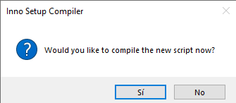

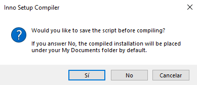

#### MacOS

Run the following command

```
pyinstaller --additional-hooks-dir installers/pyinstaller_hooks/ --name TempicoSoftware --onefile --noconsole -i Sources/tausand_small.png main.py
```

Two folders will be created: build and dist. Inside `dist` you'll find the `.app` file. This file can be run from a console by executing the command
To change the icon of the `.app` file follow the instructions here https://appleinsider.com/articles/21/01/06/how-to-change-app-icons-on-macos

#### Linux

Run the following command

```
pyinstaller --additional-hooks-dir installers/pyinstaller_hooks/ --name TempicoSoftware --onefile --noconsole -i Sources/tausand_small.png main.py
```

Two folders will be created: build and dist. Inside dist you'll find the executable file. This file can be run from a console by executing the command

```
./TempicoSoftware
```

If it doesn't run, make sure it has execute permissions. In case it doesn't run `chmod +x TempicoSoftware` and then try again. The executable file could be used to create a Desktop entry so it can be lauched as an application (for example in Gnome, an icon could be assigned)

To create an AppImage that can be run from multiple Linux distributions and be launch by double clicking, follow the next steps.

* Create the following folder path: 
    TempicoSoftware.AppDir/usr/bin
* Place the executable inside the bin folder 
* Place the icon tausand_small.png located at Sources/tausand_small.png inside TempicoSoftware.AppDir
* Create a file called TempicoSoftware.desktop inside TempicoSoftware.AppDir
* Edit the `.desktop` file with the following

```
[Desktop Entry]
Name=TempicoSoftware
Exec=TempicoSoftware
Icon=tausand_small
Type=Application
Categories=Utility;
```

* Give execution permisions to the `.desktop` file: `chmod +x TempicoSoftware.desktop`
* Create a script called `AppRun` with the following contents

```
#!/bin/bash
SELF=$(readlink -f "$0")
HERE=${SELF%/*}
EXEC="${HERE}/usr/bin/TempicoSoftware"
exec "${EXEC}"
```

* Give execution permisions to the `AppRun` file: `chmod +x AppRun`. After this step, the app should run after doing `./AppRun` on a Terminal.

* For 64-bit architecture, download appimagetool-x86_64.AppImage from https://github.com/AppImage/AppImageKit/releases/ and give execution permisions to it. 

* Place appimagetool outside TempicoSoftware.AppDir and run

```
  ARCH=x86_64 ./appimagetool-x86_64.AppImage TempicoSoftware.AppDir
```

* The file `TempicoSoftware-x86_64.AppImage` will be created. This file can be opened by double clicking it.
