# Tempico Software

Tempico Software is a suite of tools built to ensure your experience with Tausand's time-to-digital converter.

The software operates via a Graphical User Interface (GUI) which facilitates user interaction with the Tausand Tempico hardware.

## Libraries Used

- **HID**
- **Matplotlib**
- **NumPy**
- **PyInstaller**
- **PyQT5**: Using the API provided by pyside2.
- **PyQtGraph**
- **PySerial**
- **PyTempico**
- **Scipy**

## UML Overview

The UML diagram provides a high-level approximation of the application’s design structure.

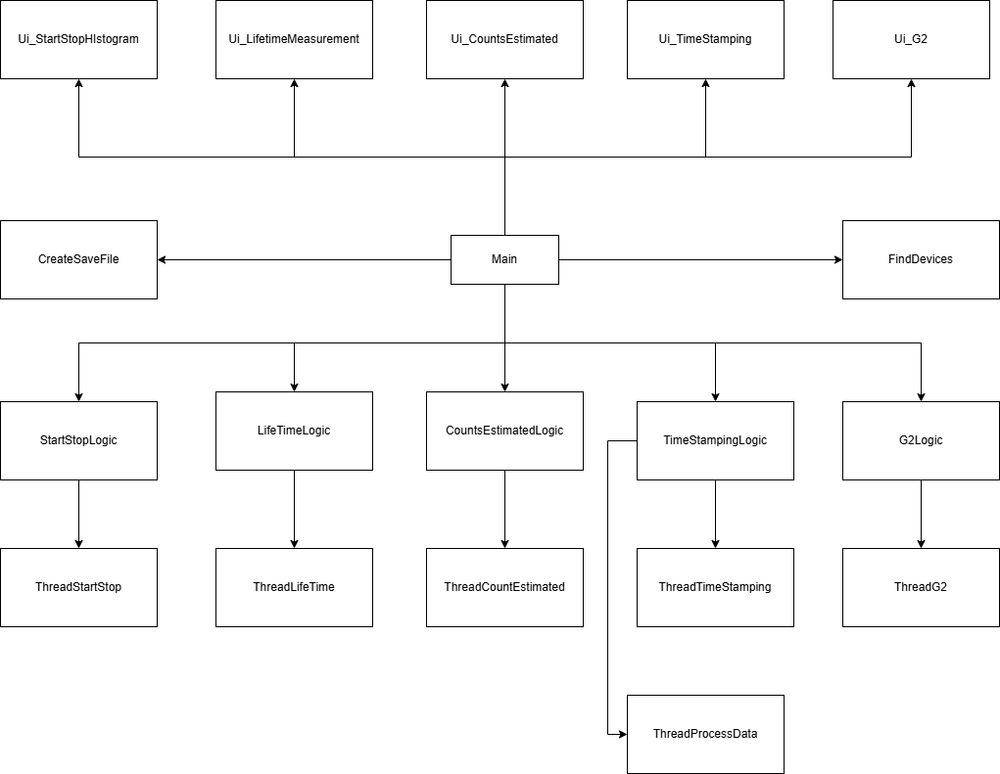

# Functionality

## Open TempicoSoftware

Tempico software always initializes with a dialog that shows the list of Tempico devices connected to the computer. The user can select one of them to open a connection or cancel and initialize the software without a device. Without a device, the software has only two functionalities: see the About window in the navbar next to Settings or connect a device. If the computer doesn't have a Tempico device connected, the dialog doesn't show any device, and you will only be able to cancel or close the window.

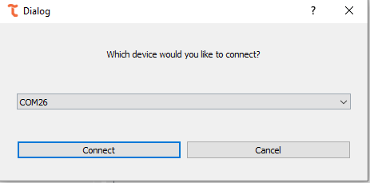

## General settings

The user can configure two parameters of the Tempico device: the first is the threshold voltage and the second is the number of runs. The threshold voltage accepts float numbers between 0.9 V and 1.6 V. The number of runs is a value between 1 and 1000 ( In a single call for measurement, the hardware will execute the specified number of measurements without needing another call for each individual measurement)

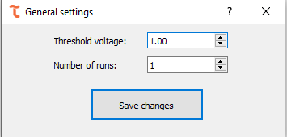

## Channel settings

The user can configure 5 parameters for each stop channel (A, B, C, D). The first is the average cycles, which are the internal measurements performed before obtaining a single averaged output value. Increasing the cycles improves the precision of the data but also increases the time required for each measurement. The accepted values are 1, 2, 4, 8, 16, 32, 64, and 128.

The second parameter is the mode. There are 2 modes, and each mode changes the time ranges of data accepted before the start pulse. In mode 1, the accepted values are between 12 ns and 500 ns, and in mode 2, the values are between 125 ns and 4 ms. The two modes are independent of each other (in other words, if you try to measure in mode 2 a value in the range of mode 1, the data will not be registered).

The third parameter is the number of stops. This parameter determines the number of stops that the channel registers after a single start. However, if the channel expects 5 stops and only gets 4, none of the values will be considered in the data. The accepted stops are 1, 2, 3, 4, and 5.

The fourth parameter is the edge type. In each channel, you can decide if the measured data is the beginning of the stop pulse (RISE) or the end of the stop pulse (FALL).

The fifth parameter is the stop mask. It indicates the range of times in which the measurements will be discarded. For example, if the stop mask is 10 µs, the measurements in the range 0 µs - 10 µs will not be considered. The stop mask accepts values between 0 µs and 4000 µs.

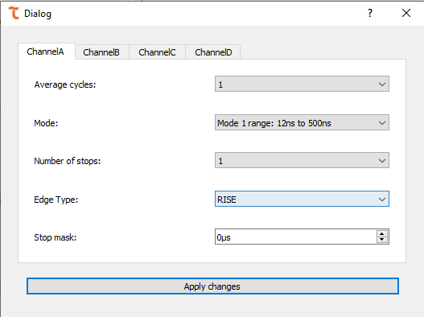

## Main window Start-stop histogram

### Before measurement

Before performing a measurement, the user can configure the channels and the general settings of the device. Using the checkboxes, the user can select which channels they want to appear in the graphics (at least one channel must be selected). After this, the user can press the "Begin Measurement" button. Note: Once a measurement has begun, user will not be able to change the channel settings, general settings, or select an additional channel. In the middle of a measurement, if the user wants to clear the graphic for a specific channel, it is possible to push the "Clear" button for that specific channel. To finish measurement click on the button End measurement.

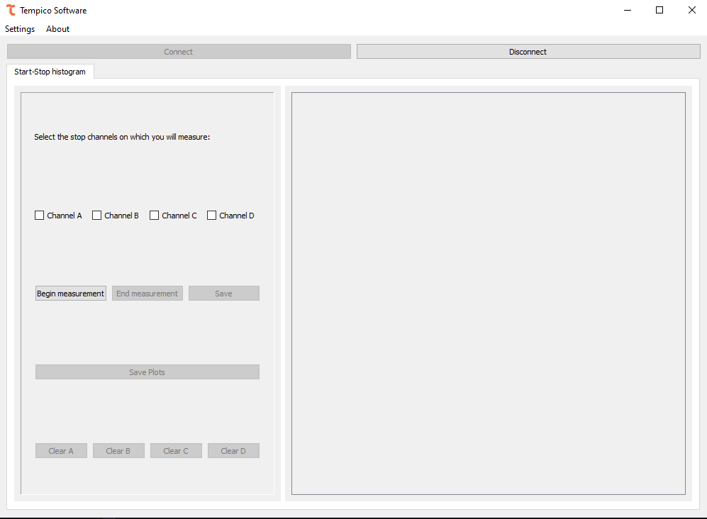

### After measurement

After finishing a measurement, if the user desires, they can save the measured data for the Tempico device in txt, csv, or dat format using the "Save" button. If the user wants to adjust the view of the graphic, they can scroll with the mouse to see more detail of the histogram. They can then save the image that appears in the software with the "Save Plots" button. The user can select png, jpg, or tiff as the format for the saved image. The route for the files will be inside documents/TempicoSoftwareData. This folder is created automatically if it doesn't exist when the software is started.

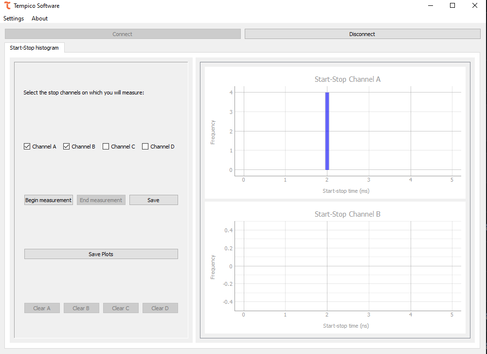

If the user is not in the middle of a measurement, they will be able to disconnect the Tempico device and connect another if they desire. The data will not be lost if the device is disconnected; data is only lost if the user begins a new measurement.

## Counts Estimated Window

### Before Measurement

Before starting the measurement, the user can select the channels on which they wish to estimate the counts. They can also choose whether they want the graphs to be merged, meaning all channel curves are displayed on a single graph; separated, where each curve has its own individual graph; or detached, where each graph appears in a separate dialog window. Additionally, the user can choose to view the measurement table in a separate dialog window and can select the time range of the graphs, such as viewing the last 10 seconds, the last 20 seconds, and so on, up to a range of 1000 seconds.

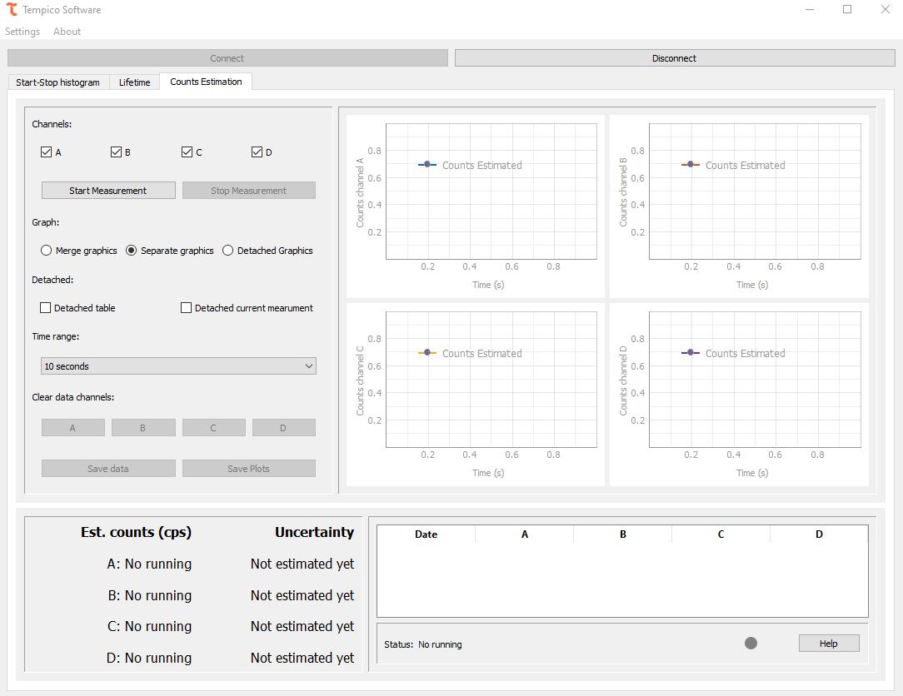

### During Measurement

While the measurement is in progress, the user can track the history of the recorded parameters in the table located at the bottom of the screen and view the current data in the panel at the lower right. Similarly, the user can observe the real-time update of the graphs for each measurement taken. Additionally, the user can interact with the entire configuration panel and clear the data of any channel if desired. The only limitation is that channels not selected before the start of the measurement cannot be selected during the measurement.
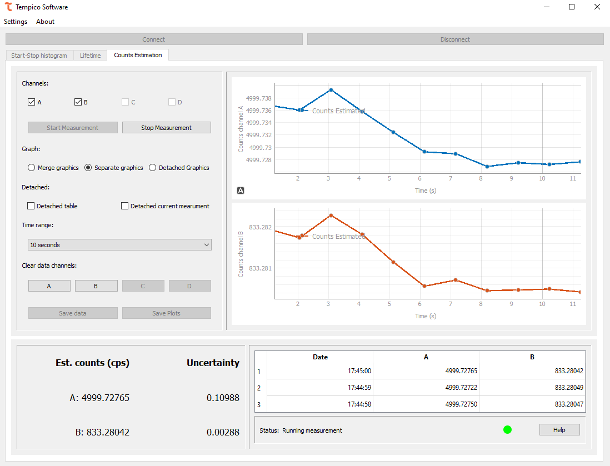

### After Measurement

After the measurement, the options to save the data and save the plots become available to the user. When saving the data, the user can choose between txt, csv, and dat formats, and for images, they can select png, tiff, or jpg formats. Likewise, the user can interact with the graph to obtain a different view before saving the image again. The time range filter remains active, and the user can also enable or disable channels if they prefer not to display the curve of a particular graph.
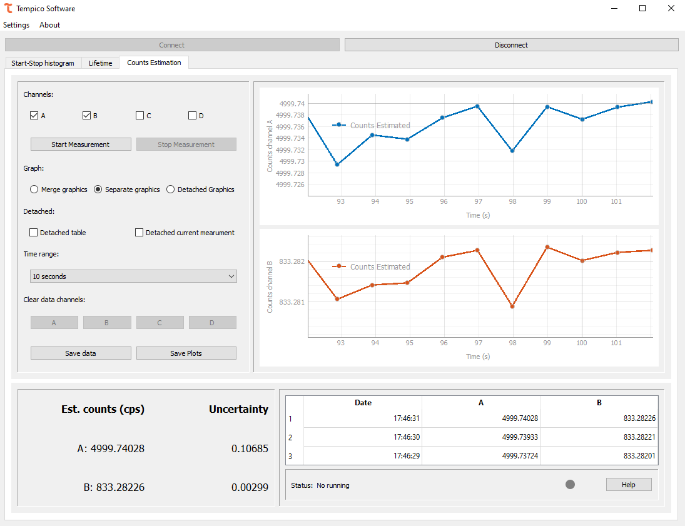

## Time Stamping Window
### Before the measurement
Before starting the measurement process, the user can select the channels from which data will be collected. The type of measurement can also be defined, choosing between manual, scheduled, or sample-size–based modes, each with its corresponding configuration parameters. By default, automatic data saving is enabled to prevent memory overflow. Additionally, the user can configure how frequently the data is written to storage, allowing the system to periodically release memory from the main buffer in a controlled manner.
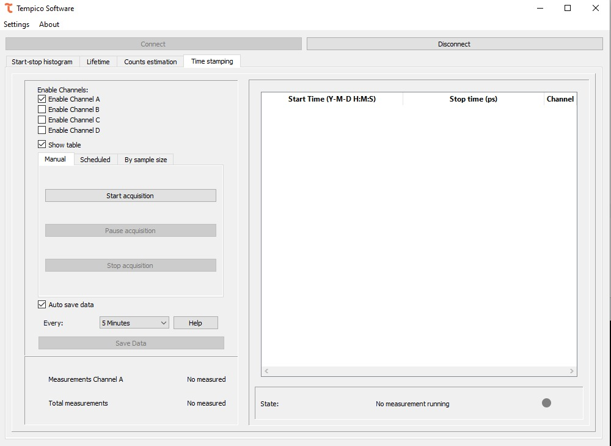

### During the measurement
During the measurement process, the collected data can be displayed in a table if desired, although it is also possible to hide this view. A status bar is available to indicate the current state of the measurement, showing whether it is running or saving, as well as the remaining time of the measurement or the percentage of progress completed.

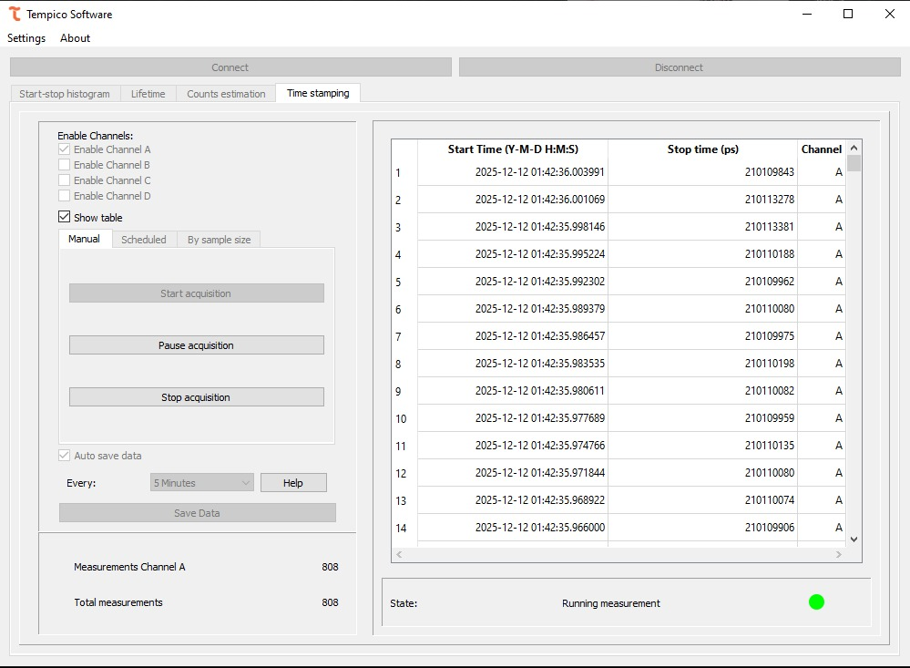

### After measurement
After the measurement is completed, the data can be saved again in a different format if desired by disabling the automatic data saving option. Additionally, the data count from the most recent measurement can be reviewed in the table.

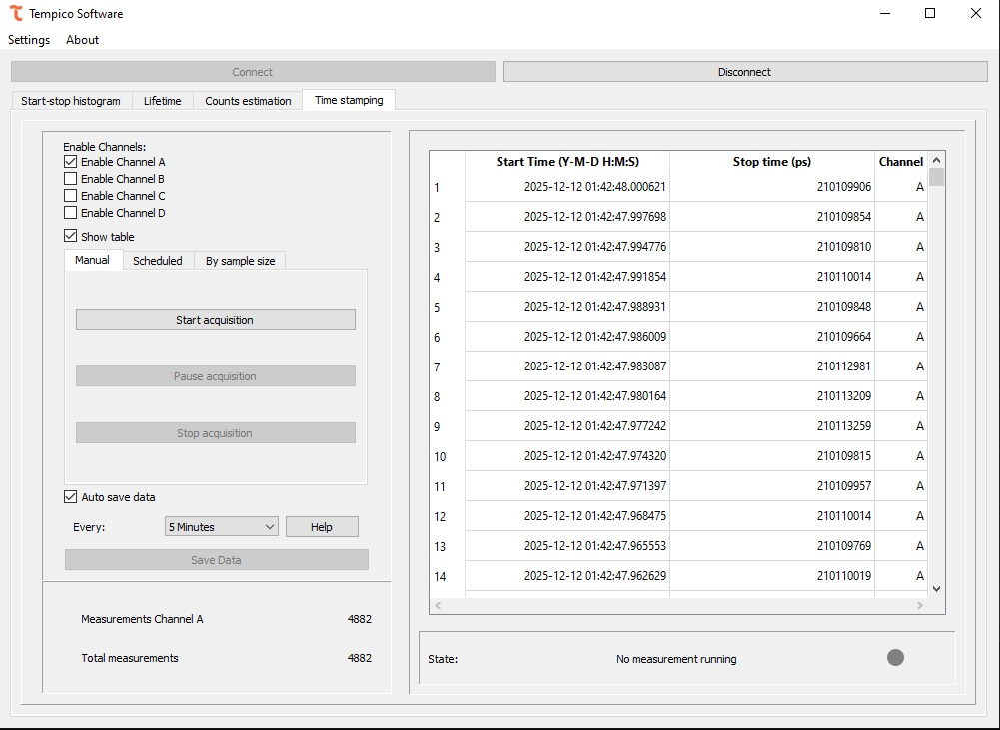

## Lifetime Window

### Before Measurement

Before measurement, the user can define the parameters they want to measure. These include selecting which channel will capture the start pulses and which channel will capture the stop pulses. The user is free to choose any channel; however, if they select a start channel different from the Start Channel, they must connect a signal that emits periodic pulses to capture the differences between the stops. Since the measurements are represented as a frequency histogram, the user can also decide the bin width and the number of bins to plot. These two factors will determine the maximum time range to be graphed. Additionally, the user can choose how many measurements to perform. It is important to note that the mode change has no effect, as the mode will adjust automatically according to the maximum time range.

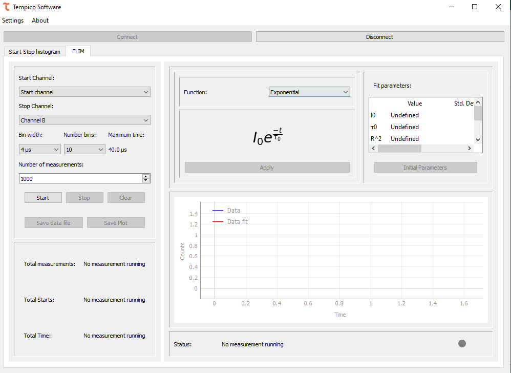

### During Measurement

While the measurement is in progress, the user can monitor several parameters. The first is the total number of successful measurements, meaning those in which both a start and a stop were captured within the specified time range. Another parameter is the total number of start pulses, which indicates how many start pulses have been received, regardless of whether a stop was captured. The total measurement time is also displayed, measured by a timer that starts when the measurement begins. The user has a status bar that indicates the percentage of the measurement completed or whether any channel is not receiving pulses.

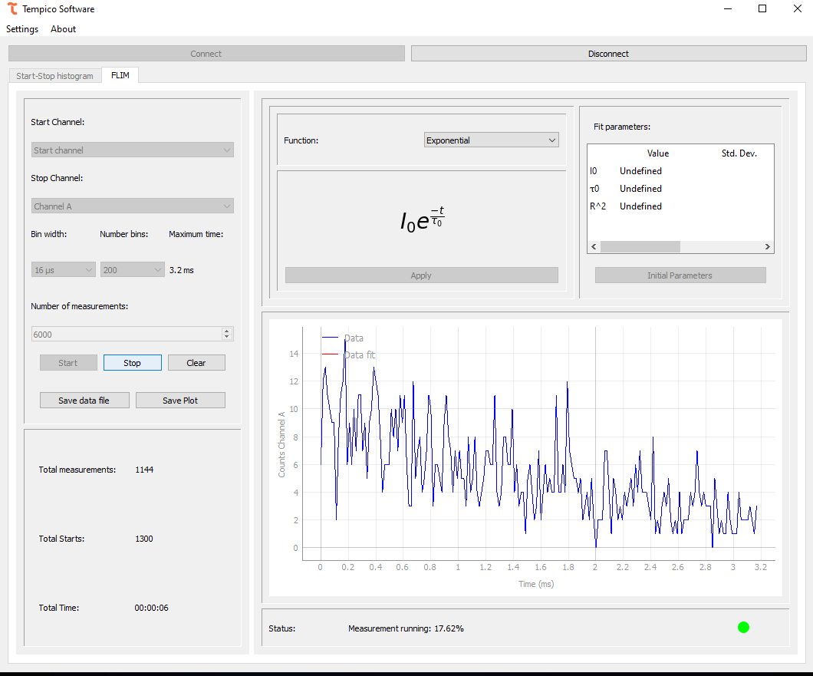

### After Measurement

After the measurement, the user can decide whether to save the image of the data or the raw data, which are saved by default in the Documents/TempicoSoftwareData directory. Additionally, the user can adjust the graph by specifying the fitting parameters. Four types of fitting are available: Exponential, Kohlrausch, Shifted Exponential, and Double Exponential. The fitting parameters are determined along with an R² value to assess the quality of the fit. If a fit was performed, the values are saved both in the graph's footer and alongside the raw data.

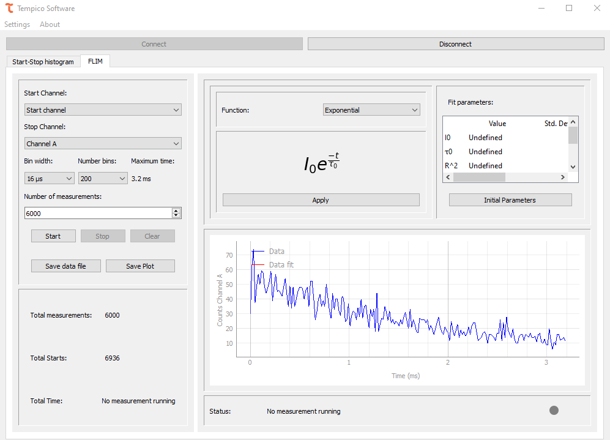

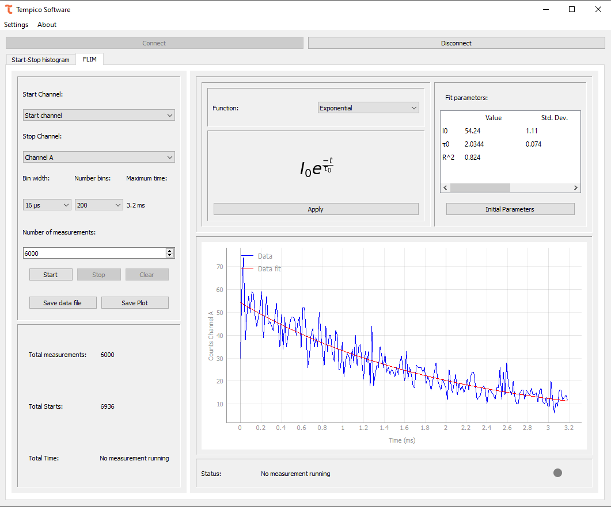

## Autocorrelation Window

### Before Measurement

In the Autocorrelation (FCS) tab, the user can configure the correlator parameters before starting a measurement: the stop channel (A, B, C, or D), and the base bin width τ₀ in µs (from 1 µs up to 10,000,000 µs). The user can also choose either a fixed measurement duration in seconds (from 1 second up to 24 hours) or enable continuous measurement, which ignores the duration and keeps the correlator running until the user presses "Stop".

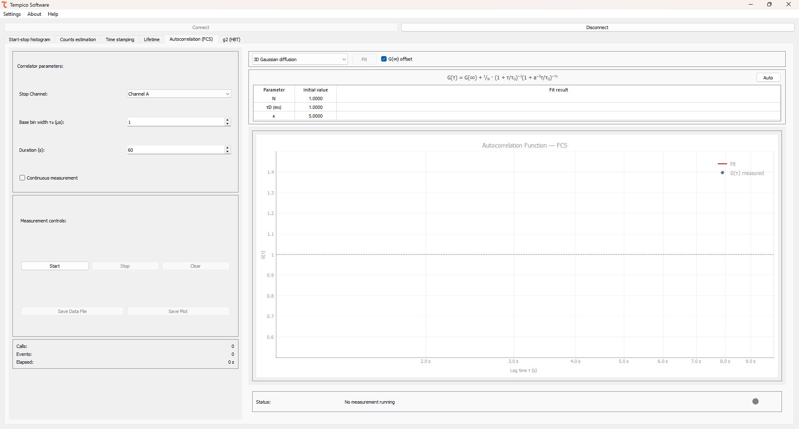

### During Measurement

While the measurement is running, the stop channel, the bin width τ₀, the duration, and the continuous-measurement option are locked and cannot be changed. The autocorrelation curve G(τ) is plotted live against τ on a logarithmic time axis. A status panel reports the number of calls made to the device, the number of detected events, and the elapsed time, together with a status bar that shows a coloured dot (grey, green, yellow, or orange) and a short text describing the current state of the measurement. At any point the user can press "Clear" to reset the curve or "Stop" to end the measurement.

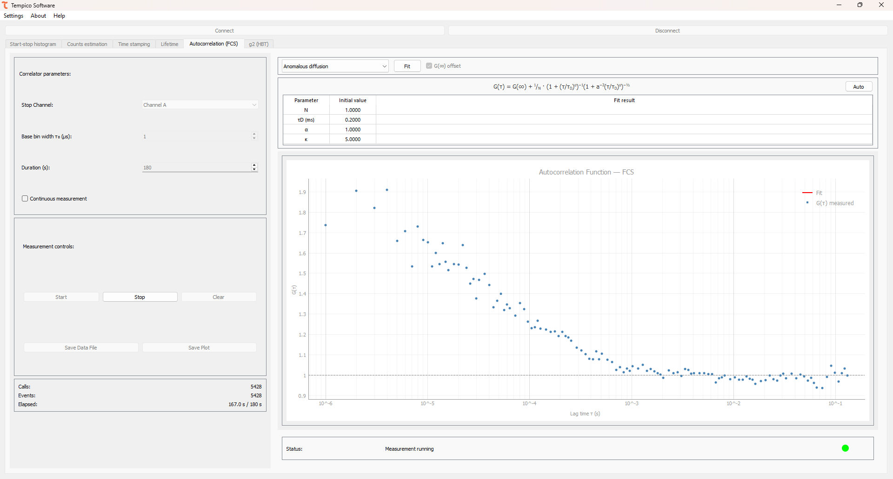

### After Measurement

Once the measurement finishes, the user can save the data with the "Save Data File" button, choosing between txt, csv, or dat formats; two files are generated: one with the τ / G(τ) pairs of the autocorrelation curve, and another with the raw stop timestamps recorded during the acquisition. The "Save Plot" button exports the graph as png, tiff, or jpg. The user can also fit the curve to one of six correlation models: 3D Gaussian diffusion, Anomalous diffusion, Chemical relaxation, Diffusion with flow, Triplet state correction, or Two-component diffusion. Each model displays its equation together with a table listing an editable "Initial value" column and a read-only "Fit result" column; the "Auto" button restores the automatically suggested initial guesses, and a dedicated checkbox allows adding a G(∞) offset to the fit. If a fit was performed, its model, equation, and resulting parameters are saved alongside the exported data.

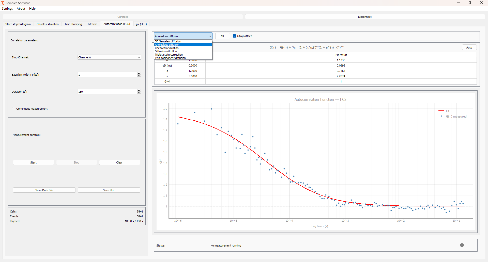

## G2 Window

### Before Measurement

In the g2 (HBT) tab, the user can configure the stop channel (A, B, C, or D), the histogram bin width in nanoseconds (from 0.1 ns up to 10,000 ns), and the coincidence window ± in nanoseconds (from 10 ns up to 100,000 ns), which sets the range of τ values displayed around zero. As in the Autocorrelation window, the user can choose a fixed measurement duration in seconds or enable continuous measurement to run until "Stop" is pressed. Optionally, the user can enable "Count Estimation" with a checkbox before starting the measurement, so a coincidence rate can be estimated and shown while measuring.

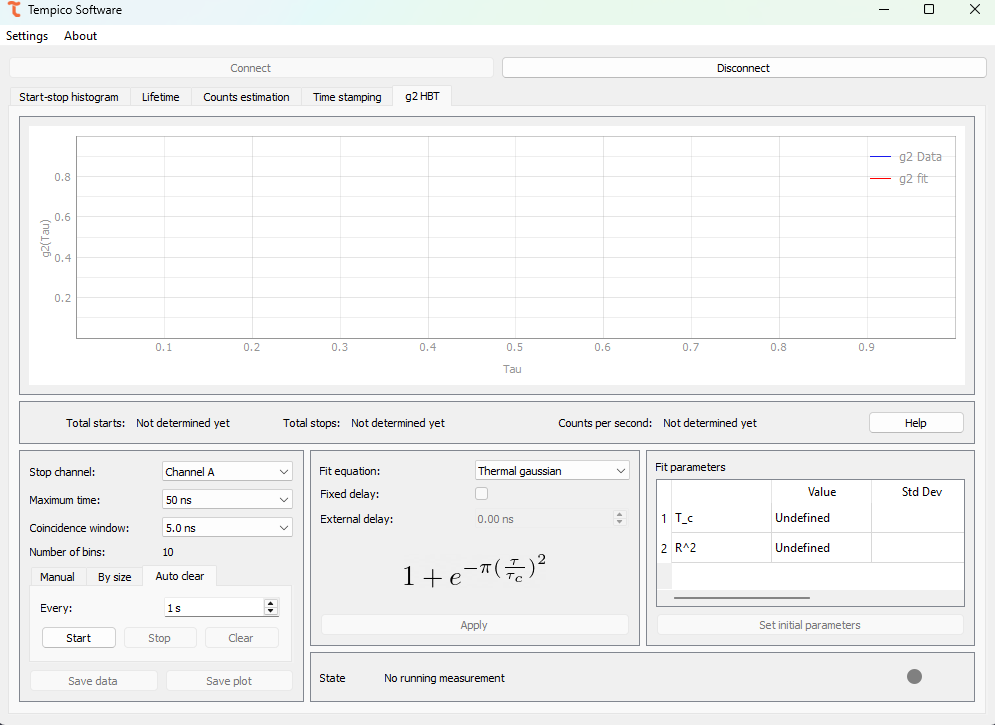

### During Measurement

Once the measurement starts, the stop channel, bin width, window, and duration are locked and cannot be changed. The g²(τ) histogram is plotted live around a reference line at g² = 1. The user can read the g²(τ) value at any τ either by clicking directly on the plot or by entering a τ value manually in the "Cursor τ" field, which is restricted to the currently configured ± window range. A status panel shows the number of detected events and the elapsed time, together with a status bar with a coloured dot and text describing the current state. The user can press "Clear" to reset the histogram or "Stop" to end the measurement. If "Count Estimation" was enabled before starting, its checkbox also stays locked during the measurement, and the status panel additionally shows the estimated coincidence rate.

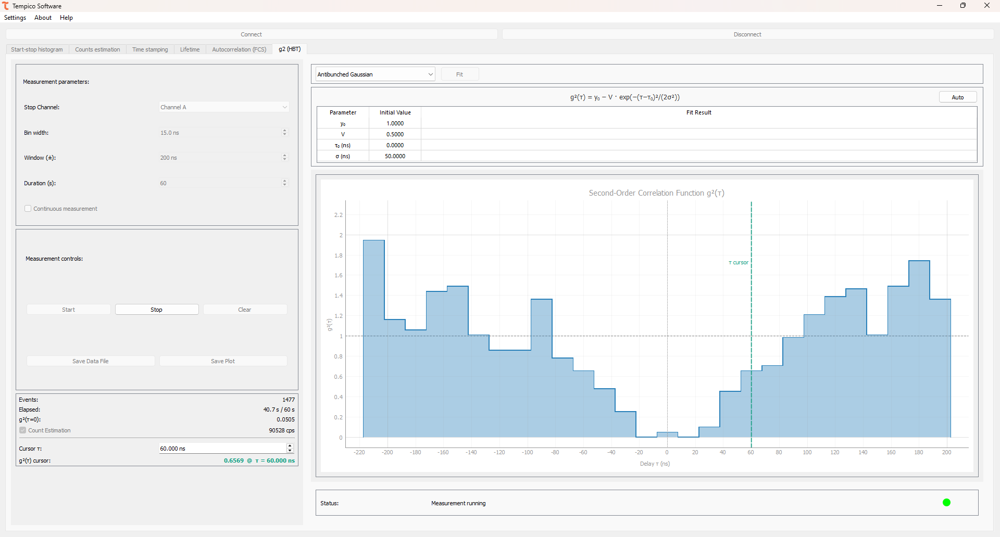

### After Measurement

After the measurement, the "Save Data" button lets the user export the results as txt, csv, or dat files; two files are generated: one with the raw start-stop times, and another with the analyzed g²(τ) curve (τ in ns and the corresponding g² value). The "Save Plot" button exports the graph as png, tiff, or jpg. The acquired histogram can also be fit to one of five models: Antibunched Gaussian, Antibunched Lorentzian, Bunched Gaussian, Bunched Lorentzian, or Three-level system. As in the Autocorrelation window, each model displays its equation together with an editable table of initial guesses and fit results, with an "Auto" button to restore the suggested initial values. If a fit was performed, its model, equation, and resulting parameters are included in the header of the exported data files.

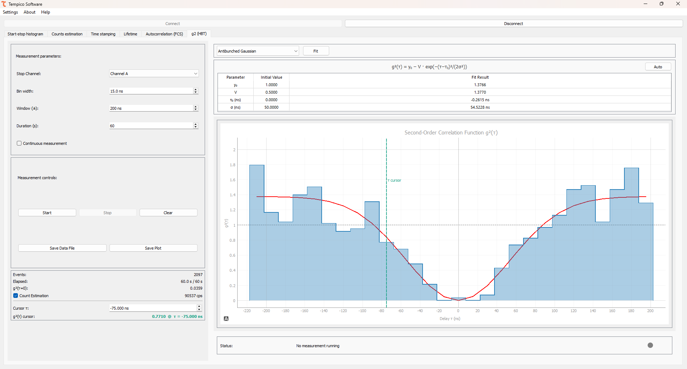

## Compatibility with TP12

Starting from version 2.0.0, the Tempico software includes compatibility with TP12XX series devices, enabling the measurement of negative time intervals of down to -200 ns between the start and stop signals. This capability enhances functionalities such as StartStopHistogram and TimeStamping, allowing for a more comprehensive analysis of temporal events.

Additionally, an internal pulse generator is introduced, allowing the generation of pulses at configurable frequencies on the selected start and stop channels. This feature facilitates controlled testing and validation of measurements within the system.

To configure this, in the settings window under the signal generator section, a tab is available that displays the source options for each channel. From there, the desired start and stop channels can be selected. If the internal option is chosen, the system will use the built-in periodic pulse generator operating at the frequency defined below. Conversely, if the external option is selected, an external signal must be provided through the corresponding Tempico input.

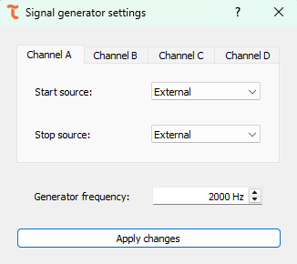

## Grant port access on Linux

Most Linux configurations have a dialout group for full and direct access to serial ports. By adding your user account to this group you will have the necessary permissions for Tempico Software to communicate with the serial ports.

1. Open Terminal.

2. Enter the following command, replacing `<username>` with the name of your account.

```
sudo usermod -a -G dialout <username>
```

3. Sign in and out for the changes to take effect.

## For Developers

### Updating to a new version

Modify the version number in the following files:

- installer/installer_builder.iss

- src/Utils/constants.py

### Creating a virtual environment

Run the following code to create a virtual environment called `.venv`

```
python -m venv .venv
```

#### Activate

- On Unix systems:

  ```
  source .venv/bin/activate
  ```

- On Windows:

  ```
  .venv\Scripts\activate
  ```

#### Deactivate

```
deactivate
```

### Installing packages

After the virtual environment has been activated, install required packages by using:

```
python -m pip install -r requirements.txt
```

From the console, in the same path of the cloned project, run

```
python src/main.py
```

This will allow the program to run correctly (if using a Linux-based OS, use `sudo` at the beginning). If the command does not work, use `python3 main.py`.

**Note**: It is recommended to use Python version 3.8.10 (32-bit). This is the last version for which numpy, scipy, and PySide2 all still publish 32-bit Windows wheels, which matters if you need to support Windows 7 32-bit (see below).

### Generating the Executable and Installer

Once dependencies are installed, the next step is building a standalone executable with PyInstaller and wrapping it in a native installer. The process differs by platform — follow the section below that matches your target OS. **Windows is covered first, then Linux, then macOS.**

#### Windows

##### Standard Build

Run the following command:

```
pyinstaller --additional-hooks-dir installers/pyinstaller_hooks/ --name TempicoSoftware --onefile --noconsole -i Sources/tausand_small.ico src/main.py
```

Two folders will be created: `build` and `dist`. Inside `dist` you'll find the `.exe` file. To run it correctly, this file must be placed next to the `Sources` folder that contains the images.

##### Generate Installer

Once the executable is compiled, we will proceed to create the software installer.

###### Step 1: Download and Install Inno Setup Compiler

First, download the Inno Setup Compiler program and install it on your machine. The download page for the program is available at the following link: [https://jrsoftware.org/isdl.php](https://jrsoftware.org/isdl.php). Download the `.exe` file corresponding to the application installer.

###### Step 2a: Create using iss file at Inno Setup Compiler

Using the File Explorer, go to the folder `installer` and double-click `installer_builder.iss` or open it from Inno Setup if it is already opened. Click on the play icon and then follow the process, which includes the creation of the installer and the installation itself.

The installer will be saved in a folder called `Output`.

If the `.iss` file does not exist, follow step 2b.

###### Step 2b: Create using Inno Setup Compiler Wizard

Once Inno Setup is installed correctly, open it and follow these steps:

1. First, you will be prompted to either open an existing script or create a new one. Select the option to **Create a New Script Using the Wizard**.

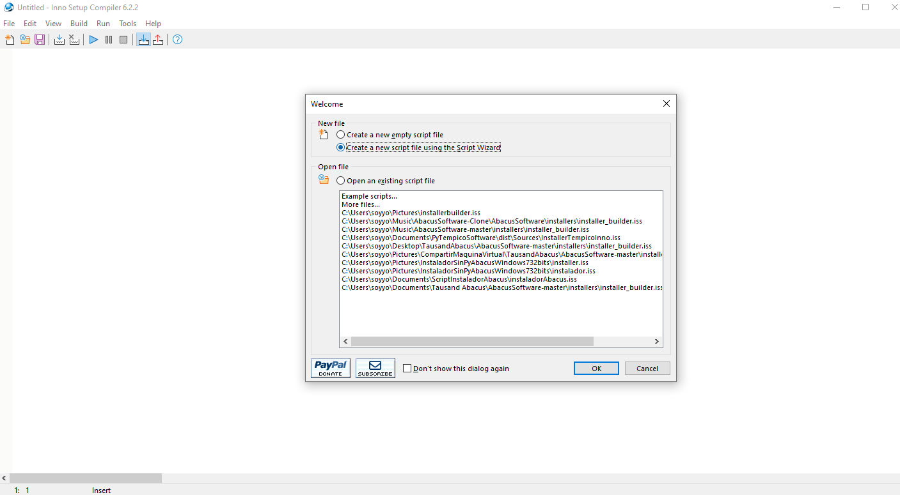

2. In the next window, leave all options unselected and click **Next**.

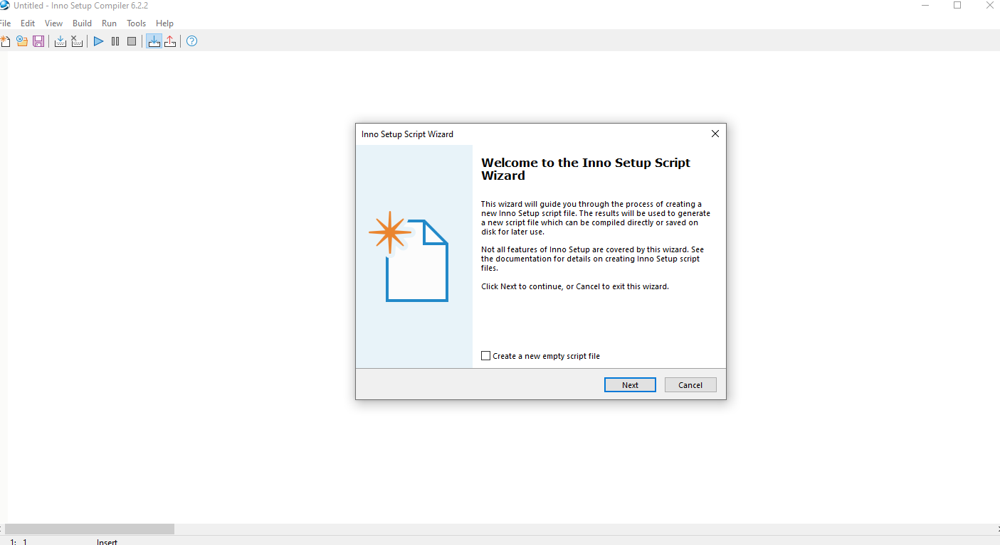

3. You will then be asked to provide the application name, version, publisher, and website (if applicable). For Tempico Software, use the following values for each field.

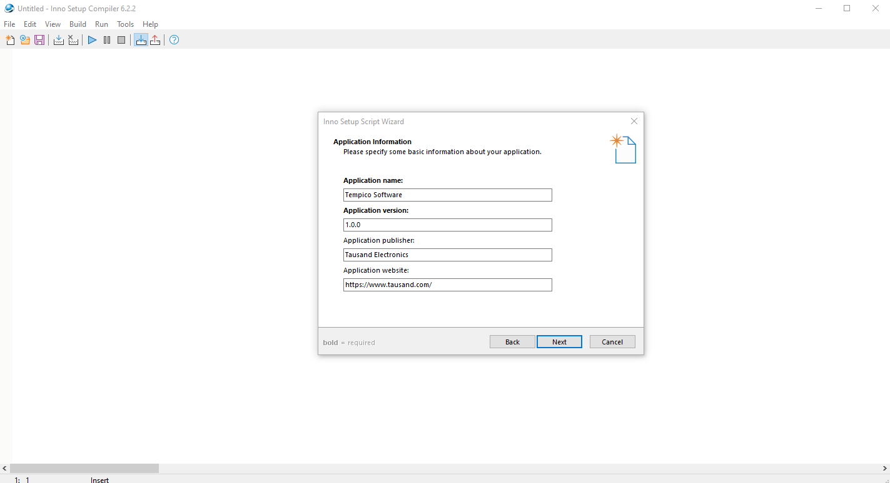

4. Next, specify the default folder for the application and the application name. If these values do not carry over from the previous step, use the specified values provided.

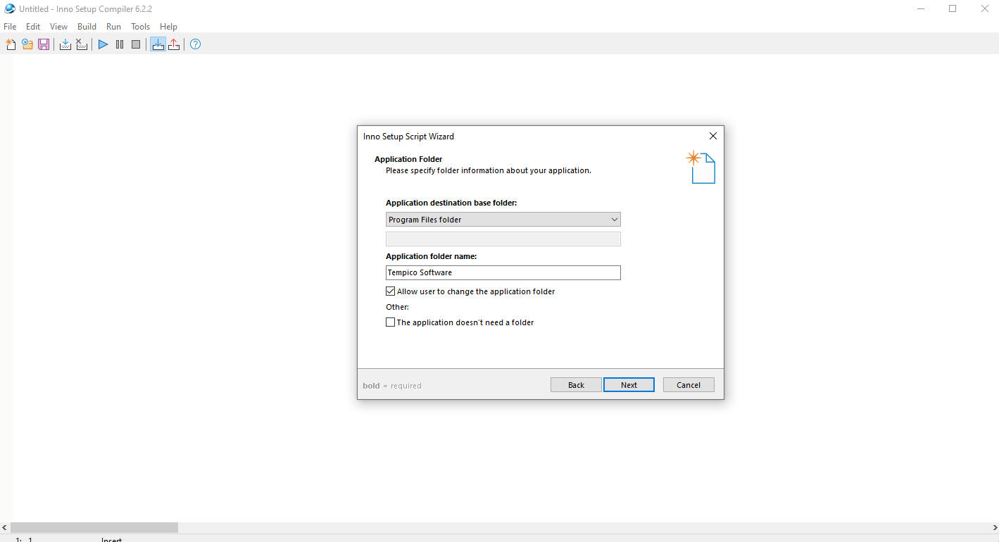

5. In the field **Application Main Executable File**, provide the path to the executable created earlier with PyInstaller. Additionally, click on **Add Folder** to include the images needed by the executable. Locate and select the `Sources` folder containing these image files. Leave all other fields as their default values.

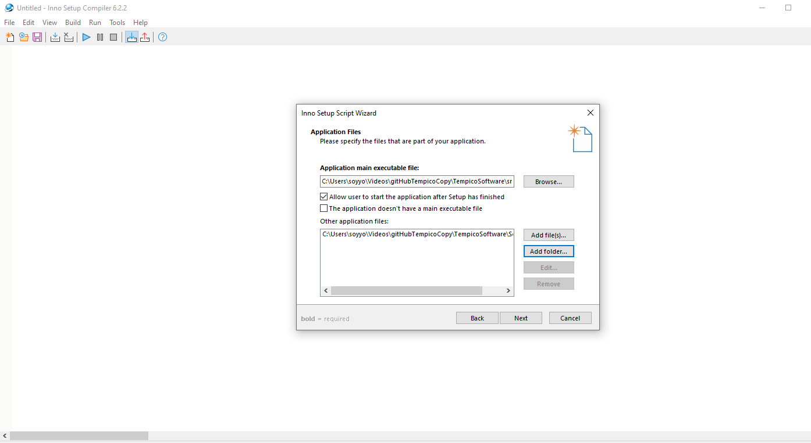

**Important — read before continuing:** see "Correctly including the `Sources` folder" right after this wizard walkthrough. Adding the `Sources` folder here the naive way is a common cause of the splash screen (and other images) not appearing after installation.

6. For the next four windows, leave the default values as they are (ensure they match the values shown in the provided screenshots).

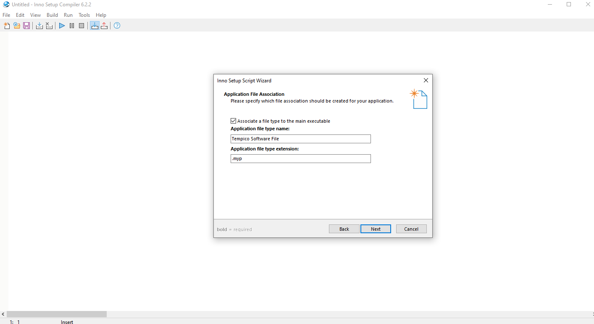

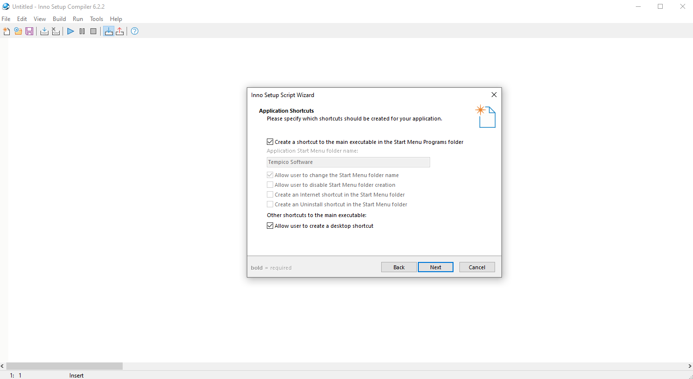

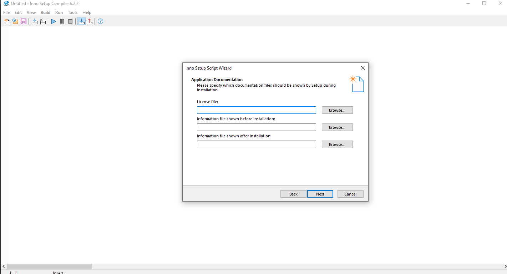

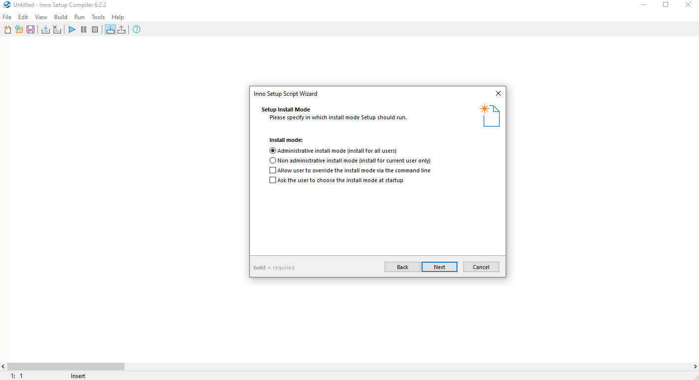

7. You will be prompted to select the installation language. Since Tempico Software only supports English for this version, select **English**.

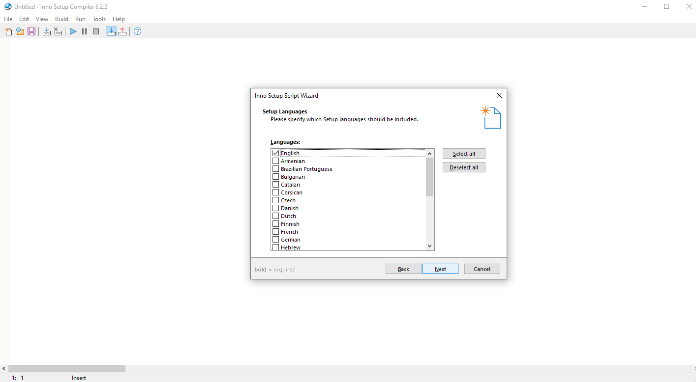

8. In the **Custom Compiler Output Folder** field, specify the directory where the installer will be saved once compiled. This path is flexible and should be chosen based on the developer's preference. In the **Compiler Output Base File Name** field, enter `Tempico Software Setup`. For **Custom Setup Icon File**, locate the `Sources` folder and select the `tausand_small.ico` icon file. Leave the password field empty.

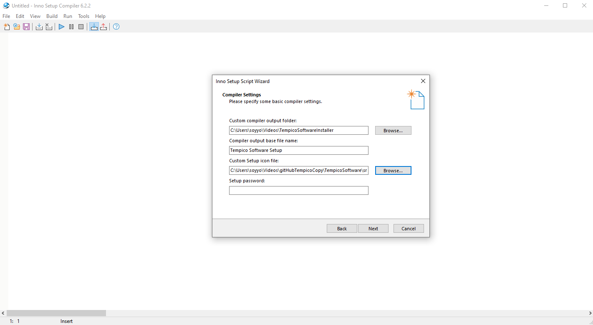

9. For the following windows, simply click **Next** and then **Finish**, keeping the default values unchanged.

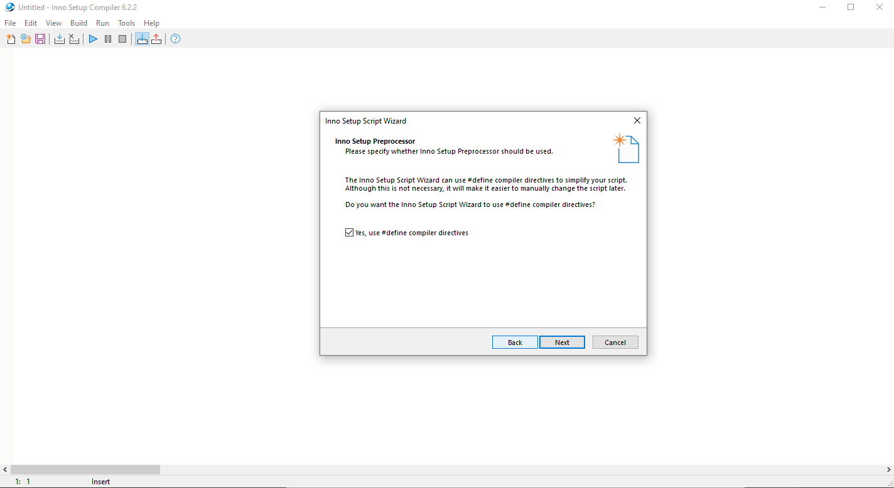

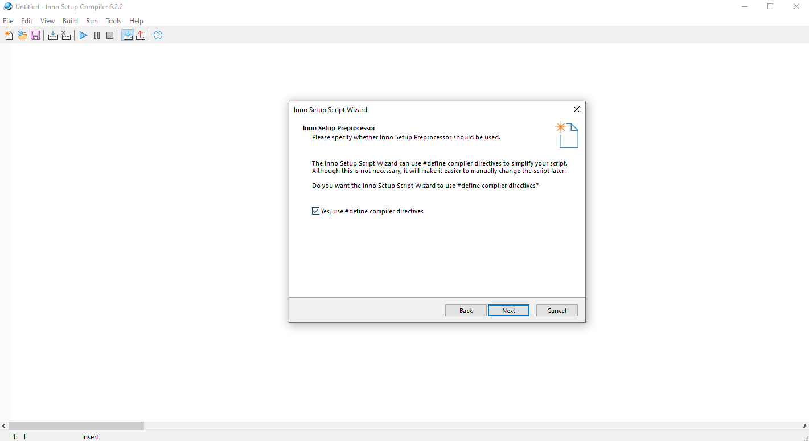

10. Once the setup wizard is completed, a window will appear asking if you want to compile the file. Click **Yes**. Another window will ask if you want to save the script. Click **Yes** and select the path to your GitHub project, saving it in the `installer` folder and naming the file appropriately. Wait for the file to compile; this will automatically generate the installer in the specified output folder, from which you can run the installer.

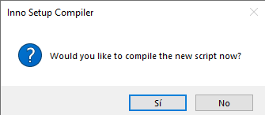

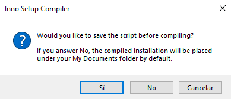

##### Correctly including the `Sources` folder (splash screen not appearing)

When using the Inno Setup Wizard's **Add Folder** button (sub-step 5 above), Inno Setup copies the *contents* of the folder you select directly into the installation directory (`{app}`) — it does **not** automatically create a `Sources` subfolder for you. If you select the `Sources` folder itself, its files end up directly at `{app}\splash.png`, `{app}\tausand_small.ico`, etc., instead of inside `{app}\Sources\`. Since the app looks for `Sources\splash.png` next to its executable, this results in the splash screen (and the About window's picture) never appearing — with no visible error, since the app is otherwise fully functional.

**Fix (wizard method):** create a temporary parent folder that contains `Sources` as a subfolder. From a Command Prompt, in your project folder:

```
mkdir SourcesWrapper
xcopy /E /I Sources SourcesWrapper\Sources
```

This gives you:

```
SourcesWrapper/
└── Sources/
    ├── splash.png
    └── tausand_small.ico
```


Then, in the wizard, click **Add Folder** and select `SourcesWrapper` — **not** `Sources` directly. Inno Setup preserves the names of folders nested *inside* the one you select, so the resulting installer correctly places everything under `{app}\Sources\`.

**Fix (`.iss` file method, preferred if editing the script directly):** if you're using Step 2a instead of the wizard, skip the workaround above entirely by setting an explicit destination in the `[Files]` section of `installer_builder.iss`:

```ini
[Files]
Source: "dist\TempicoSoftware.exe"; DestDir: "{app}"; Flags: ignoreversion
Source: "Sources\*"; DestDir: "{app}\Sources"; Flags: ignoreversion recursesubdirs createallsubdirs
```

This tells Inno Setup exactly where the folder's contents should go, regardless of how the wizard would otherwise flatten it.

After building, verify the fix worked by checking the installation folder (e.g. `C:\Program Files (x86)\Tempico Software\`) — it should contain a `Sources\` subfolder with `splash.png` and `tausand_small.ico` inside.

##### Building for Windows 7 (32-bit)

Windows 7 needs a few prerequisites that aren't present out of the box, both on the machine you build on and on any machine where the installer will be run. Each item below includes the download link and the exact command to install it.

1. **Windows 7 Service Pack 1** — required baseline for everything below. If you need a full Windows 7 (32-bit) install that already includes SP1 slipstreamed in, this ISO can be used: [https://archive.org/details/en_windows_7_ultimate_with_sp1_x86_dvd_u_677460_202006](https://archive.org/details/en_windows_7_ultimate_with_sp1_x86_dvd_u_677460_202006). If you already have Windows 7 installed without SP1, install it via Windows Update instead.

2. **Universal C Runtime update (UCRT)** — Python 3.8 (and the C extensions in numpy/scipy) depend on the UCRT, which Windows 7 does not ship by default. Without it, the app fails to start with a missing `api-ms-win-crt-*.dll` error. Download one of the following (either works; KB3118401 supersedes KB2999226):
   - KB2999226 (x86): [https://www.microsoft.com/en-us/download/details.aspx?id=51537](https://www.microsoft.com/en-us/download/details.aspx?id=51537)
   - KB3118401 (x86): [https://www.microsoft.com/en-us/download/details.aspx?id=51137](https://www.microsoft.com/en-us/download/details.aspx?id=51137)

   Install it silently from an elevated Command Prompt (adjust the filename to whichever you downloaded):

   ```
   wusa.exe Windows6.1-KB2999226-x86.msu /quiet /norestart
   ```

   Restart when prompted.

3. **KB2533623** — required to avoid DLL search-order compatibility issues with PyInstaller-generated executables.
   - Download: [https://archive.org/details/kb-2533623-windows-7](https://archive.org/details/kb-2533623-windows-7) (`Windows6.1-KB2533623-x86.msu`)
   - Install it silently:

     ```
     wusa.exe Windows6.1-KB2533623-x86.msu /quiet /norestart
     ```

   - Restart the system when prompted.

4. **Microsoft Visual C++ Redistributable 2015-2022 (x86)** — provides `vcruntime140.dll` and related libraries needed by numpy, scipy, and Qt.
   - Download: [https://aka.ms/vs/17/release/vc_redist.x86.exe](https://aka.ms/vs/17/release/vc_redist.x86.exe)
   - Install it silently:

     ```
     vc_redist.x86.exe /quiet /norestart
     ```

   - **To bundle it inside your own installer** (so users don't need to install it manually), add it to `installer/installer_builder.iss`:

     ```ini
     [Files]
     Source: "vc_redist.x86.exe"; DestDir: "{tmp}"; Flags: deleteafterinstall

     [Run]
     Filename: "{tmp}\vc_redist.x86.exe"; Parameters: "/quiet /norestart"; StatusMsg: "Installing Visual C++ Redistributable..."
     ```

5. **Python 3.8.10 (32-bit)** — download the installer explicitly marked **"Windows x86 executable installer"** (not "x86-64") from [https://www.python.org/downloads/release/python-3810/](https://www.python.org/downloads/release/python-3810/). Create your `.venv` with it:

   ```
   C:\Python38-32\python.exe -m venv .venv
   .venv\Scripts\activate
   ```

   Confirm you're in a true 32-bit interpreter:

   ```
   python -c "import struct; print(struct.calcsize('P') * 8)"
   ```

   This should print `32`.

Once all five items above are installed, proceed with PyInstaller and Inno Setup exactly as described earlier in this section.

#### Linux

##### Prerequisites

Install the required FUSE library (needed for PyInstaller single-file executables and to run AppImages directly):

```bash
sudo apt install libfuse2
```

##### Generate Standard Installer

Run the following command:

```
pyinstaller --additional-hooks-dir installers/pyinstaller_hooks/ --name TempicoSoftware --onefile --noconsole -i Sources/tausand_small.png src/main.py
```

Two folders will be created: `build` and `dist`. Inside `dist` you'll find the executable file. This file can be run from a console by executing the command:

```
./TempicoSoftware
```

If it doesn't run, make sure it has execute permissions. In case it doesn't run `chmod +x TempicoSoftware` and then try again. The executable file could be used to create a Desktop entry so it can be launched as an application (for example in Gnome, an icon could be assigned).

##### Generate Optimized Installer (< 100 MB)

A plain `--onefile` build (even with only the scipy exclusions) results in an executable of ~112 MB. Packaging that file as-is into an AppImage does **not** shrink it further: PyInstaller's `--onefile` mode already compresses its payload internally, and squashfs (used by AppImage) cannot meaningfully compress data that is already compressed. To get a final AppImage under 100 MB, three things are needed: build with `--onedir` instead (so squashfs has real uncompressed data to work with), remove the duplicated OpenBLAS library that numpy and scipy each bundle separately, and strip a handful of unused Qt plugins. Combined, these take a build that is 300+ MB uncompressed down to a ~96 MB final AppImage.

###### Step 1: Share a single OpenBLAS between numpy and scipy (optional, saves ~30-60 MB)

By default, the numpy and scipy wheels from PyPI each embed their **own private copy** of OpenBLAS (two files of ~32 MB each, in different variants, that cannot be deduplicated by a compressor). Recompiling both from source against the system's OpenBLAS removes this duplication:

```bash
sudo apt install libopenblas0-pthread liblapack3 libopenblas-dev liblapack-dev \
  gfortran python3-dev build-essential pkg-config

pip uninstall -y numpy scipy

# numpy does not depend on pythran, it builds directly
pip install --no-binary numpy --no-cache-dir numpy

# scipy's build toolchain (pythran/gast/beniget/cython) is version-sensitive
# on Python 3.8 (EOL); these pinned versions are known to work together
pip install meson-python ninja pybind11
pip install "cython<3.0"
pip install "pythran==0.14.0" "gast==0.5.4" "beniget==0.4.2.post1"

pip install --no-build-isolation --no-binary scipy --no-cache-dir scipy \
  -Csetup-args=-Dblas=openblas -Csetup-args=-Dlapack=openblas
```

Verify both now share the same system library (should print the same `openblas-pthread` path for both, and `find .venv -iname "*openblas*"` should return nothing):

```bash
python3 -c "import numpy; numpy.show_config()" | grep -i blas
python3 -c "import scipy; scipy.show_config()" | grep -i blas
```

If this step fails on your machine (old Python 3.8 build toolchains are fragile) or you'd rather not compile from source, skip it — Steps 2 and 3 alone are lower risk and still give meaningful savings.

###### Step 2: Build with PyInstaller in `--onedir` mode

```bash
pyinstaller \
  --additional-hooks-dir installers/pyinstaller_hooks/ \
  --name TempicoSoftware \
  --onedir \
  --noconsole \
  -i Sources/tausand_small.png \
  --exclude-module matplotlib \
  --exclude-module PySide2.QtQml --exclude-module PySide2.QtQuick --exclude-module PySide2.QtQuickWidgets \
  --exclude-module PySide2.QtWebEngineCore --exclude-module PySide2.QtWebEngineWidgets \
  --exclude-module PySide2.QtWebChannel --exclude-module PySide2.QtWebSockets \
  --exclude-module PySide2.QtMultimedia --exclude-module PySide2.QtMultimediaWidgets \
  --exclude-module PySide2.QtNetwork --exclude-module PySide2.QtSql \
  --exclude-module PySide2.QtTest --exclude-module PySide2.QtXml \
  --exclude-module PySide2.QtBluetooth --exclude-module PySide2.QtDBus \
  --exclude-module PySide2.Qt3DCore --exclude-module PySide2.Qt3DRender \
  --exclude-module PySide2.QtCharts --exclude-module PySide2.QtDataVisualization \
  --exclude-module PySide2.QtHelp --exclude-module PySide2.QtDesigner --exclude-module PySide2.QtUiTools \
  --exclude-module PySide2.QtLocation --exclude-module PySide2.QtPositioning \
  --exclude-module PySide2.QtSensors --exclude-module PySide2.QtNfc --exclude-module PySide2.QtSerialPort \
  --exclude-module PySide2.QtPrintSupport --exclude-module PySide2.QtVirtualKeyboard \
  --exclude-module pyqtgraph.opengl \
  --exclude-module scipy.cluster --exclude-module scipy.fft --exclude-module scipy.integrate \
  --exclude-module scipy.interpolate --exclude-module scipy.io --exclude-module scipy.ndimage \
  --exclude-module scipy.odr --exclude-module scipy.signal --exclude-module scipy.stats \
  --exclude-module scipy._lib._uarray \
  src/main.py
```

Two folders will be created: `build` and `dist`. `dist/TempicoSoftware/` now contains the executable plus all of its shared libraries as separate files (instead of a single self-extracting binary).

###### Step 3: Strip unused Qt plugins and translations

The standard PySide2 PyInstaller hook copies every Qt plugin category and all translations, regardless of whether the app uses them. Tempico Software only needs the `xcb` platform plugin (X11) and English text, so the rest can be removed:

```bash
cd dist/TempicoSoftware

rm -f PySide2/Qt/plugins/platformthemes/libqgtk3.so
rm -f libgtk-3.so.0
rm -rf PySide2/Qt/plugins/platforminputcontexts
rm -f libQt5VirtualKeyboard.so.5
rm -f PySide2/Qt/plugins/platforms/libqwayland*.so
rm -rf PySide2/Qt/plugins/wayland-graphics-integration-client
rm -rf PySide2/Qt/plugins/wayland-decoration-client
rm -rf PySide2/Qt/plugins/wayland-shell-integration
rm -f libwayland-egl.so.1 libwayland-cursor.so.0 libwayland-client.so.0
rm -f libQt5WaylandClient.so.5
rm -f PySide2/Qt/plugins/platforms/libqminimalegl.so
rm -f PySide2/Qt/plugins/platforms/libqeglfs.so
rm -f PySide2/Qt/plugins/platforms/libqlinuxfb.so
rm -f PySide2/Qt/plugins/platforms/libqvnc.so
rm -f PySide2/Qt/plugins/platforms/libqwebgl.so
rm -rf PySide2/Qt/translations

cd ../..
```

**Always test the app after this step**, with a copy of `Sources/` placed next to the executable, before packaging it:

```bash
cp -r Sources dist/TempicoSoftware/
cd dist/TempicoSoftware && ./TempicoSoftware && cd ../..
```

Confirm the splash screen, window style, device connection, and at least one curve fit (Lifetime/FCS/g2) still work correctly.

##### Create AppImage

To create an AppImage that can be run from multiple Linux distributions and be launched by double clicking, follow the next steps. This assumes the app was built with `--onedir` as described above — a `--onefile` executable does not compress further when packaged this way, since it is already an internally-compressed blob.

Run the following commands from the project root:

```bash
# 1. Create the AppDir folder structure
mkdir -p TempicoSoftware.AppDir/usr/bin

# 2. Copy the entire contents of dist/TempicoSoftware/ (not just the executable)
cp -r dist/TempicoSoftware/* TempicoSoftware.AppDir/usr/bin/

# 3. Copy the Sources folder next to the executable
cp -r Sources TempicoSoftware.AppDir/usr/bin/

# 4. Copy the icon to the root of the AppDir (appimagetool looks for it there)
cp Sources/tausand_small.png TempicoSoftware.AppDir/

# 5. Create the .desktop file
cat > TempicoSoftware.AppDir/TempicoSoftware.desktop << 'EOF'
[Desktop Entry]
Name=TempicoSoftware
Exec=TempicoSoftware
Icon=tausand_small
Type=Application
Categories=Utility;
EOF
chmod +x TempicoSoftware.AppDir/TempicoSoftware.desktop

# 6. Create the AppRun script
cat > TempicoSoftware.AppDir/AppRun << 'EOF'
#!/bin/bash
SELF=$(readlink -f "$0")
HERE=${SELF%/*}
cd "${HERE}/usr/bin"
exec "${HERE}/usr/bin/TempicoSoftware"
EOF
chmod +x TempicoSoftware.AppDir/AppRun
```

Note the `cd` before the `exec` in `AppRun`: the `Sources` folder is located relative to the executable's own directory, and without this `cd` the working directory when double-clicking the AppImage (or launching it from a `.desktop` entry) may not match, causing the splash screen to fail to load even though the rest of the app runs fine.

After this step, the app should run by doing `./TempicoSoftware.AppDir/AppRun` from a terminal.

- For 64-bit architecture, download `appimagetool-x86_64.AppImage` from [https://github.com/AppImage/AppImageKit/releases/](https://github.com/AppImage/AppImageKit/releases/) and give execution permissions to it:

  ```bash
  wget https://github.com/AppImage/AppImageKit/releases/download/continuous/appimagetool-x86_64.AppImage
  chmod +x appimagetool-x86_64.AppImage
  ```

- Place `appimagetool` outside `TempicoSoftware.AppDir` and run:

  ```bash
  ARCH=x86_64 ./appimagetool-x86_64.AppImage TempicoSoftware.AppDir
  ```

- The file `TempicoSoftware-x86_64.AppImage` will be created. This file can be opened by double clicking it.

- Verify the final size with `ls -lh TempicoSoftware-x86_64.AppImage`. Following the Optimized Installer steps above, this should land around 95-100 MB.


#### macOS

##### Prerequisites

Install the dependencies pinned for the macOS 10.12 build:

```bash
python3 -m venv .venv
source .venv/bin/activate
pip install -r requirements_macos10.12.txt
```

##### Step 1: Build with PyInstaller

```bash
export MACOSX_DEPLOYMENT_TARGET=10.12

rm -rf build dist

pyinstaller --additional-hooks-dir installers/pyinstaller_hooks/ \
  --name TempicoSoftware --onedir --noconsole \
  -i Sources/tausand_small.png \
  src/main.py

APP="dist/TempicoSoftware.app"
```

##### Step 2: Place the `Sources` folder correctly

Non-code resources must live in `Contents/Resources`, not `Contents/MacOS` — otherwise code signing fails on files like images inside `Sources` (see Step 3). A symlink keeps the existing runtime lookups working without any source changes:

```bash
mkdir -p "$APP/Contents/Resources"
cp -r Sources "$APP/Contents/Resources/"
ln -sf ../Resources/Sources "$APP/Contents/MacOS/Sources"
```

##### Step 3: Sign the bundle (ad-hoc)

Signing must happen from the inside out (nested libraries and frameworks first, main executable and full bundle last), otherwise Qt frameworks commonly end up with a broken/partial signature:

```bash
find "$APP" -type f \( -name "*.so" -o -name "*.dylib" \) -exec codesign --force -s - {} \;

find "$APP/Contents/Frameworks" -maxdepth 1 -name "*.framework" 2>/dev/null | while read fw; do
  codesign --force -s - "$fw"
done

codesign --force -s - "$APP/Contents/MacOS/TempicoSoftware"
codesign --force -s - "$APP"
```

##### Step 4: Verify the signature

```bash
codesign --verify --deep --strict --verbose=4 "$APP"
```

This should complete with no errors. Note: `spctl -a -t exec` will always report `rejected` for an ad-hoc signature (it checks for Apple notarization, not signature validity) — this is expected and can be ignored.

##### Step 5: Editing the installer script (`Install TempicoSoftware.command`)

The installer script and the PDF guide are kept in `installer/macos/` in the repository — not regenerated on every build. Edit the script directly with `cat` and a heredoc (`EOF`) whenever a change is needed:

```bash
cat > "installer/macos/Install TempicoSoftware.command" << 'EOF'
#!/bin/bash
SCRIPT_DIR="$(cd "$(dirname "$0")" && pwd)"
cd "$SCRIPT_DIR"

DEST="/Applications/TempicoSoftware.app"

echo "Installing TempicoSoftware..."
rm -rf "$DEST"
ditto "TempicoSoftware.app" "$DEST"

for i in $(seq 1 20); do
  if [ -x "$DEST/Contents/MacOS/TempicoSoftware" ]; then
    break
  fi
  sleep 0.5
done

xattr -cr "$DEST"

echo "Done. Opening TempicoSoftware..."
open "$DEST"

# Clean up only the copied app and this script — keep the PDF instructions in place
rm -rf "$SCRIPT_DIR/TempicoSoftware.app"
sleep 1
rm -f "$0"
EOF

chmod +x "installer/macos/Install TempicoSoftware.command"
```

##### Step 6: Build the installer package

Copy the app together with the installer script and the PDF guide from `installer/macos/`:

```bash
STAGING="dist/dist_package"
rm -rf "$STAGING" && mkdir -p "$STAGING"
cp -R "$APP" "$STAGING/"
cp "installer/macos/Install TempicoSoftware.command" "$STAGING/"
cp "installer/macos/READ ME Installation Guide.pdf" "$STAGING/"
```

The staging folder should now contain exactly three items: `TempicoSoftware.app`, `Install TempicoSoftware.command`, and `READ ME Installation Guide.pdf`.

##### Step 7: Package the final `.zip`

```bash
ditto -c -k --sequesterRsrc --keepParent "$STAGING" "dist/TempicoSoftware-10.12+.zip"
```

`ditto` must be used instead of Finder's "Compress" option or the `zip` command — both can break the app's code signature by not preserving symlinks and extended attributes correctly.

This `.zip` is the distributable file, compatible from macOS 10.12 through the latest release.

##### Installation instructions for the end user

**Step 1. Unzip the installer**

Double-click the downloaded file to extract its contents into a new folder. You should see three files inside:

- `TempicoSoftware.app`
- `Install TempicoSoftware.command`
- `READ ME Installation Guide.pdf`

**Step 2. Open Terminal**

Press Command (⌘) + Space, type "Terminal", and press Enter.

**Step 3. Clear the security flag**

macOS marks downloaded files with a security flag that blocks them from opening until it's cleared. Type the following in Terminal, including the trailing space, but don't press Enter yet:

```bash
xattr -d com.apple.quarantine 
```

Drag `Install TempicoSoftware.command` from the unzipped folder into the Terminal window, right after the command — this fills in the file path automatically. Then press Enter.

**Note:** on some machines, Terminal may respond with `No such xattr: com.apple.quarantine`. This is not an error — it just means that particular Mac's security settings didn't flag the file with the quarantine attribute in the first place, so there was nothing to remove. It's safe to continue to the next step regardless.

**Step 4. Run the installer**

Double-click `Install TempicoSoftware.command`. If macOS shows a security warning, go to **System Settings → Privacy & Security**, scroll to the Security section, and click **Open Anyway**.

**Step 5. Done**

TempicoSoftware installs into Applications and opens automatically. The installer script removes itself once done, leaving only the PDF guide in the unzipped folder — that folder can be deleted at any time.

For detailed screenshots of each step, see `READ ME Installation Guide.pdf`.

##### Changing the icon

To change the icon of the `.app` file, follow the instructions here: [https://appleinsider.com/articles/21/01/06/how-to-change-app-icons-on-macos](https://appleinsider.com/articles/21/01/06/how-to-change-app-icons-on-macos)

## Generate sphinx documentation

### First time generating

The first thing we need to do is verify that the Sphinx library is installed in our environment. If it is not installed, we can do so with the command:

```
pip install sphinx
```

If it doesn't work, we use:

```
pip3 install sphinx
```

Next, we need to install the theme used for the documentation; to do this, run the command:

```
pip install sphinx-rtd-theme
```

Next, within the repository folder where the project is located, we will create a new folder called `docs/developer`. To create the base folder for our project, run the `sphinx-quickstart` command on the `docs/developer` folder. The project will be named "Tempico Software", and the version will correspond to the one on which the software documentation is being created. We will leave the language set to English.

Inside the `docs/developer` folder, several files will have been generated, one of which is called `conf.py`. This file contains a list called `extensions`; within it, we will add the following extensions:

```
"sphinx.ext.todo", "sphinx.ext.autodoc", "sphinx.ext.viewcode"
```

We will also change the script's path so that when it runs, it can recognize the scripts inside the `src` folder. To do this, we add the following line of code at the beginning, even before the imports:

```
sys.path.insert(0, os.path.abspath('../../src'))
```

Now there should be a text variable called `html_theme`; here, we will change the default theme and set it to `sphinx_rtd_theme`.

After that, we must execute the following command:

```
sphinx-apidoc -o docs/developer ./src
```

This will create a `.rst` file in the `docs/developer` folder for each of the Python scripts we have for the application. Many of these scripts contain information about graphical interfaces or may even be auxiliary; it is not necessary to document them, so we can delete their `.rst` files. Only the names of the files that have not been deleted should remain in the `modules.rst` file.

Inside `docs/developer`, we will create a folder called `sources` and place the Tempico Software logo there. Then, we will edit the file called `index.rst` and place the logo at the beginning as follows:

```
.. figure:: sources/image.png
   :scale: 60 %
   :alt: Tausand logo
   :align: center
```

Under the title, we will add the description of the software, outlining each of the functionalities.

Next, we need to configure the `index.rst` file. By default, the following block is created:

```
.. toctree:: :maxdepth: 1 :caption: Contents:
```

Below this block, leaving a blank line, we need to add all the modules with `.rst` at the end of each one.

Finally, what we will do is change the value of `_build` to `build` in the `exclude_patterns` variable in the `conf.py` file. We will also make this change in the `make.bat` file on the line `set BUILDDIR`, and in the `Makefile` under the `BUILDDIR` setting.

Once we are sure that all the modules to be documented have a `.rst` file and are included in the `modules.rst` file, we will generate the documentation by running the following command in the `docs/developer` folder:

```
.\make.bat html
```

The generated HTML file will be found inside the `build` folder.

To generate a PDF file, we first need to download and install MikTeX and Strawberry Perl. This can be done from the following websites: [https://miktex.org/download](https://miktex.org/download) and [https://strawberryperl.com](https://strawberryperl.com). Afterward, we need to add both programs to the environment variables. Once this process is complete, we can verify that everything is working correctly by executing the following command:

```
latexmk --version
```

Then, inside the `docs/developer` folder, we execute the following command:

```
.\make.bat latexpdf
```

This will generate our documentation in PDF format.

### Generate documentation for a new version

If we create a new script for a new version that has not been documented yet is not necessary to run all steps executed before. However we need to run the following command again:

```
sphinx-apidoc -o docs/developer ./src
```

This will regenerate all `.rst` files for all Python scripts inside the `.src` folder. We must again remove the `.rst` files for the modules that were not documented and delete them from `modules.rst`. It is necessary to reconfigure the `index.rst` file as specified in previous steps.

Make sure that in the `make.bat` file, the `BUILDDIR` variable is set to `build` and not `_build`, and do the same in the `Makefile`. If that's the case, simply change them.

After this , we can run the commands again to generate the documentation according to the required format:

```
.\make.bat html
```

```
.\make.bat latexpdf
```

If the developer did not create a new script, they only need to run the previous commands to update the documentation.