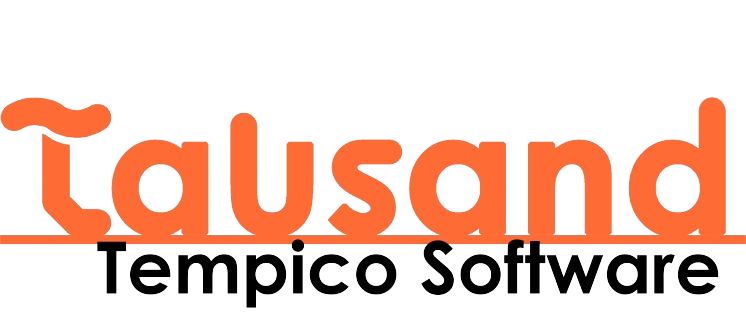

.. Tempico Software documentation master file, created by
   sphinx-quickstart on Sun Jan  5 16:02:09 2025.
   You can adapt this file completely to your liking, but it should at least
   contain the root `toctree` directive.

Welcome to Tempico Software's documentation!
============================================

.. contents::
   :depth: 2

Tempico Software is a program developed by Tausand Electronics, with Joan Amaya, David Guzman and Miguelangel Garcia as the lead developers. It is implemented in Python, utilizing key libraries such as PyQt5 (integrated with PySide2) for the graphical user interface, HIDAPI for serial communication, and PyGraph for data visualization. The software facilitates the use of Tausand Tempico TP1004 and TP1204 devices, streamlining the creation of histograms and lifetime measurements. For more information, visit tausand.com.

Release |release|

.. toctree::
   :maxdepth: 1
   :caption: Contents:

   main
   StartStopLogic
   CountsEstimatedLogic
   TimeStampLogic
   LifeTimeLogic
   FCSLogic
   G2Logic
   ThreadProccessData
   ThreadStartStop
   ThreadCountEstimated
   ThreadTimeStamping
   ThreadLifeTime
   ThreadFCS
   ThreadG2

   
   
   

Indices and tables
==================

* :ref:`genindex`
* :ref:`modindex`
* :ref:`search`